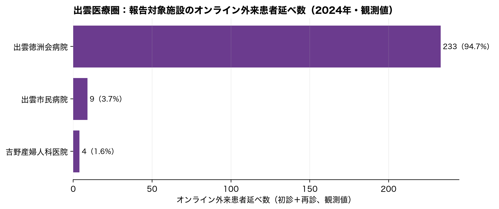
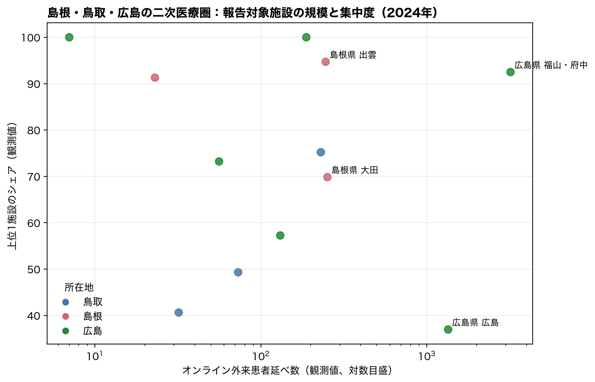
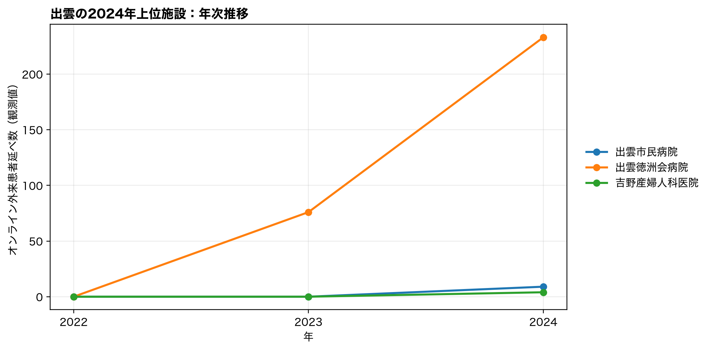

# 出雲の施設集中：外来機能報告による補助検証

## 結論

2024年の出雲二次医療圏では、オンライン外来の観測患者延べ数 246 のうち、最大の1施設が 233（94.7%）、上位2施設で 98.4% を占めた。これは**外来機能報告の対象になった施設に限れば**少数施設集中である。

一方、2023年の同データはNDB地域集計の0.84%にしか相当しない規模であり、公開外来機能報告だけでは、NDBで見えた出雲の約9千回を「1〜2施設が担う」ことも「地域全体に広がる」ことも判定できない。むしろ、無床診療所の報告が任意であるという制度上の報告枠と、保険請求をほぼ全数捕捉するNDBとの間に大きな観測枠の差があることが、今回の定量検証で明確になった。

## 何を検証したか

- 厚生労働省『外来機能報告』オープンデータの2022–2024年ファイルから、各施設の年次レコード（報告月=0）を抽出した。病院・有床診療所等が主たる対象で、無床診療所は任意報告である。
- 指標は「初診（情報通信機器を用いた場合）」と「再診（情報通信機器を用いた場合）」の外来患者延べ数の和。NDBの算定回数とは定義が異なるため、施設集中の有無を確かめる目的に限定した。
- `*` 等の非数値セルは0へ置換せず、表の「*等を含む施設数」として別に示した。以下のシェアは数値として観測できた患者延べ数に対するシェアである。

## 出雲での集中度

| 年 | 報告施設数 | オンライン利用あり（観測値） | 患者延べ数（観測値） | 上位1施設シェア | 上位2施設シェア | *等を含む施設数 |
| --- | --- | --- | --- | --- | --- | --- |
| 2022 | 18 | 0 | 0 | — | — | 0 |
| 2023 | 18 | 1 | 76 | 100.0% | 100.0% | 1 |
| 2024 | 18 | 3 | 246 | 94.7% | 98.4% | 0 |

| 施設名 | 市区町村 | オンライン初診 | オンライン再診 | 合計（観測値） | 医療圏内シェア | 累積シェア | *等あり |
| --- | --- | --- | --- | --- | --- | --- | --- |
| 出雲徳洲会病院 | 出雲市 | 1 | 232 | 233 | 94.7% | 94.7% | なし |
| 出雲市民病院 | 出雲市 | 0 | 9 | 9 | 3.7% | 98.4% | なし |
| 吉野産婦人科医院 | 出雲市 | 2 | 2 | 4 | 1.6% | 100.0% | なし |

完全観測かつ患者延べ数100以上の全国140医療圏との比較では、上位1施設シェアは高い順40位である。 この順位は「利用率が高い」ことの順位ではなく、利用がある地域の中で少数施設へ偏る程度の比較である。

## 鳥取・広島を含む地域比較

出雲の極端さが規模だけなのか、施設集中も伴うのかを確認するため、島根・鳥取・広島の全二次医療圏を同じ年次・同じ外来機能報告で比較した。

| 都道府県 | 二次医療圏 | 報告施設数 | 利用あり施設（観測値） | 患者延べ数（観測値） | 上位1施設シェア | 上位2施設シェア | *等を含む施設数 |
| --- | --- | --- | --- | --- | --- | --- | --- |
| 鳥取県 | 東部 | 20 | 2 | 230 | 75.2% | 100.0% | 0 |
| 鳥取県 | 中部 | 15 | 3 | 73 | 49.3% | 84.9% | 0 |
| 鳥取県 | 西部 | 33 | 5 | 32 | 40.6% | 68.8% | 0 |
| 島根県 | 大田 | 7 | 3 | 252 | 69.8% | 95.6% | 0 |
| 島根県 | 出雲 | 18 | 3 | 246 | 94.7% | 98.4% | 0 |
| 島根県 | 松江 | 22 | 2 | 23 | 91.3% | 100.0% | 0 |
| 広島県 | 福山・府中 | 63 | 5 | 3,201 | 92.5% | 97.0% | 0 |
| 広島県 | 広島 | 142 | 15 | 1,347 | 37.0% | 47.1% | 0 |
| 広島県 | 尾三 | 30 | 1 | 188 | 100.0% | 100.0% | 0 |
| 広島県 | 広島中央 | 24 | 3 | 131 | 57.3% | 92.4% | 0 |
| 広島県 | 呉 | 35 | 2 | 56 | 73.2% | 100.0% | 0 |
| 広島県 | 広島西 | 15 | 1 | 7 | 100.0% | 100.0% | 0 |

## 上位施設の年次推移

この図は2024年の上位施設を遡って描いたものであり、各年の全上位施設を網羅するものではない。施設コードを用いて年次を結んでいるが、施設統合・移転や報告範囲の変化は区別できない。

## NDB地域集計との位置づけ：仮説を検証できなかった理由

2023年は、外来機能報告の観測患者延べ数 76 は、同じ医療圏のNDB主要3項目 9,002 の0.84%にとどまった。NDB主要3項目が100回以上で欠測のない143医療圏中では、この比率は小さい順27位である。

この乖離は、単位の違いだけでは説明できないほど大きい。外来機能報告の上位施設が、NDB地域集計の主要な算定主体であると推論してはならない。無床診療所が任意報告であるため、NDBの大部分が公開外来機能報告に現れない無床診療所から来ている可能性、または両制度の報告範囲・時点・計上ルールの差が考えられる。ただし、公開データだけではいずれを区別できない。

したがって、今回の施設別データが与える答えは二段階である。(1) 報告対象施設内には明瞭な少数施設集中がある。(2) しかしその部分はNDBの出雲集計を説明するには小さすぎる。NDBの極端値の供給主体を確認するには、施設別NDB特別抽出で、各施設の保険請求実数・診療科・患者住所地・継続診療の別を確認する必要がある。

## 限界

- 外来機能報告は施設報告の患者延べ数であり、NDBのレセプト算定回数ではない。両データの差は、期間・集計単位・対象報告施設・診療区分の差を含む。特に無床診療所は任意報告である。
- 外来機能報告のみから、保険診療か自由診療か、NDB地域集計に占める施設別寄与、患者の居住地・流入を判定できない。
- 小さい値が `*` 等で非数値となる場合があるため、ここでの施設シェアは観測部分に対する値である。特に小規模な医療圏同士の集中度比較は慎重に扱う。
- 施設名・コードの年次照合は公開コードに依存しており、組織再編等による連続性までは検証していない。

## 出典

- 厚生労働省 [令和6年度外来機能報告公表データ](https://www.mhlw.go.jp/stf/seisakunitsuite/bunya/open_data_00019.html)（本リポジトリ `data/raw/gairaikinouhoukoku/2022.xlsx`、`2023.xlsx`、`2024.xlsx`）。同ページに、報告対象が病床機能報告対象医療機関等と意向確認済みの無床診療所である旨が示されている。
- NDB供給地集計との比較：本リポジトリ `output/tables/ndb_provider_sma_year.csv`。NDBの定義・患者住所地との区別は `output/reports/ndb_supply_geography_report.html` を参照。
