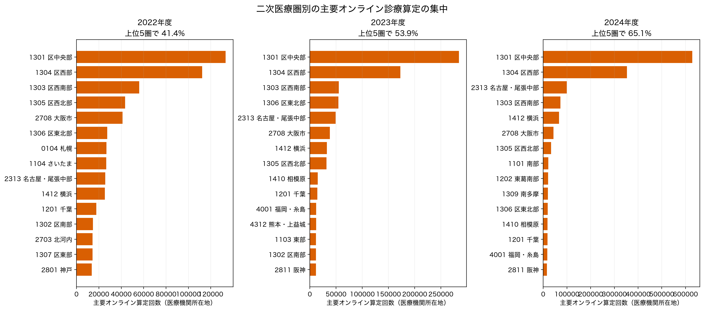
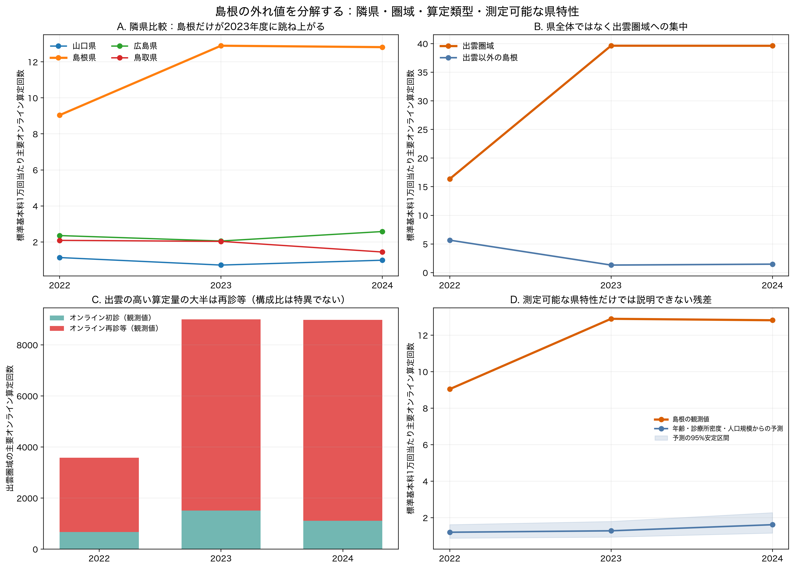
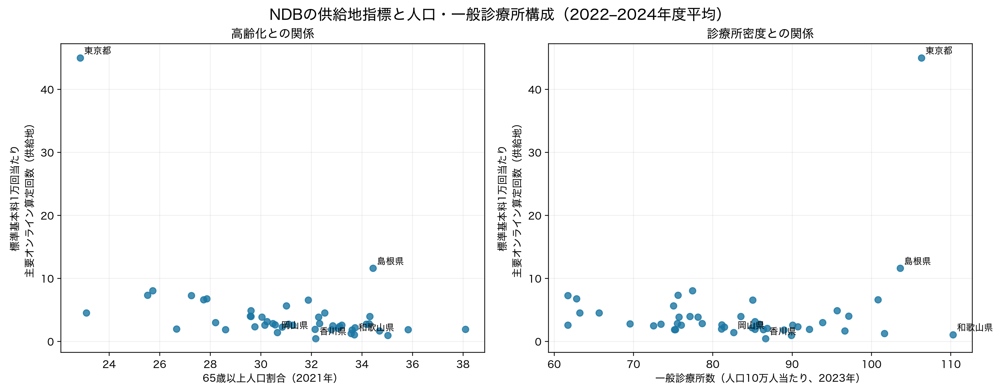

# NDB保険診療に限定した供給地の地域分析

## 結論

2022–2024年度のNDBオープンデータを、情報通信機器を用いた初診料・再診料・外来診療料の3主要項目で再集計した。医療機関所在地で見ると、二次医療圏の上位5圏だけで2023年度の主要オンライン算定回数の **53.9%** を占めた。都道府県・二次医療圏のこの集中は、患者の居住地別需要の不足を直接示すものではない。[中医協総会第625回「外来（その3）」p.19](https://www.mhlw.go.jp/content/10808000/001591982.pdf) のNDBデータ（2024年9–11月診療分）では、異なる二次医療圏の患者が **75.4%**、異なる都道府県の患者が **51.1%** を占める。これは全国集計であり島根の流入・流出を示す値ではないが、供給地と患者側地域を同一視できない直接の根拠である。

島根の突出は、高齢県一般の需要では説明しにくい。2023年度には、二次医療圏表で観測された島根県内の主要オンライン算定の **92.6%** が出雲圏域に集中し、出雲の率は県内の他圏域の **30.1倍** だった。年齢構成・診療所密度・人口規模・年度を用いる島根除外予測でも、2023年度の観測率は予測の **10.1倍** である。確定できるのは「出雲を所在地とする医療機関群で、オンライン算定の量・率が高い」という事実までで、内訳の再診等割合自体は全国的に特異ではない。外来機能報告の報告対象施設だけを見ると少数施設への集中は観察されるが、同報告の2023年観測値はNDBの0.84%にとどまり、NDBの担い手を示す証拠にはならない。一つ又は少数施設への集中、診療科構成、県外患者の流入のどれが原因かは、NDBオープンデータだけでは識別できない。

## NDB集計の定義と検証

- 対象はNDBオープンデータの医科・外来算定回数。2024年度は第10回との整合のため、公費レセプトを含む版を用いた。自由診療はNDBのこの集計には含まれない。
- 分子は「情報通信機器を用いた」初診料、再診料、外来診療料の3主コード。これらは情報通信機器関連の全細目の全国算定回数を次の割合で捕捉する。

| 年度 | 主要3項目 | 情報通信機器を用いた全関連項目 | 主要3項目の捕捉率 |
| --- | --- | --- | --- |
| 2022 | 937,551 | 945,055 | 99.21% |
| 2023 | 1,146,520 | 1,151,412 | 99.58% |
| 2024 | 1,875,679 | 1,880,754 | 99.73% |

- 分母は通常の初診料・再診料・外来診療料の3主コードの算定回数である。したがって、指標は患者数・受療率・施設数ではなく、**供給地における標準的な外来基本料1万回当たりのオンライン算定回数**と解釈する。
- NDBの都道府県・二次医療圏は医療機関所在地である。二次医療圏表には圏判別不可があるため、都道府県表との合計一致は前提にしない。

## 地理的集中

2023年度に主要3項目がすべて明示的に0だった二次医療圏は 21 圏だった。一方、主要3項目のどれかが秘匿記号（「-」）であった圏が 159 圏あり、これらを0とは数えていない。厚労省の別集計では、同年度に情報通信機器を用いた診療全体が0の二次医療圏は66圏と報告されている。これは細目の範囲と秘匿処理が異なるため、今回の明示的0数と直接比較せず、二次医療圏間の集中が大きいという独立した確認として扱う。

### 2024年度の上位二次医療圏

| 二次医療圏コード | 二次医療圏 | 主要オンライン算定回数 | 標準基本料1万回当たり |
| --- | --- | --- | --- |
| 1301 | 区中央部 | 628,764 | 283.8 |
| 1304 | 区西部 | 353,015 | 213.2 |
| 2313 | 名古屋・尾張中部 | 99,126 | 29.8 |
| 1303 | 区西南部 | 72,865 | 38.8 |
| 1412 | 横浜 | 66,291 | 14.9 |
| 2708 | 大阪市 | 43,187 | 10.2 |
| 1305 | 区西北部 | 33,297 | 15.1 |
| 1101 | 南部 | 21,516 | 27.4 |
| 1202 | 東葛南部 | 20,954 | 11.9 |
| 1309 | 南多摩 | 19,414 | 13.1 |

### 2022–2024年度平均で高い都道府県

| 都道府県 | 標準基本料1万回当たり | 65歳以上割合 | 一般診療所/10万人 |
| --- | --- | --- | --- |
| 東京都 | 45.0 | 22.9% | 106.3 |
| 島根県 | 11.6 | 34.4% | 103.6 |
| 神奈川県 | 8.0 | 25.7% | 77.4 |
| 愛知県 | 7.3 | 25.5% | 75.6 |
| 埼玉県 | 7.3 | 27.2% | 61.7 |
| 千葉県 | 6.8 | 27.9% | 62.8 |
| 大阪府 | 6.6 | 27.7% | 100.8 |
| 熊本県 | 6.6 | 31.9% | 85.0 |

## 島根の外れ値：機序を切り分ける検証

### 検証1：隣県との比較 — 島根だけの年度変化か

鳥取・山口は島根に近い人口規模・高齢化の対照、広島は同じ中国地方の大都市圏対照として比較した。ところが、島根の供給地率は2022年度から既に鳥取の4.3倍、広島の3.8倍であり、2023年度に12.90へ上昇して鳥取の6.4倍、広島の6.3倍になった。2024年度も12.82と維持された。単なる全国制度の立ち上がりや山陰の高齢化という説明なら、少なくとも隣県とのここまで大きな乖離と、2023年度の跳ね上がりを説明できない。

| 都道府県 | 標準基本料1万回当たり | 島根/当該県 | 65歳以上割合 | 一般診療所/10万人 |
| --- | --- | --- | --- | --- |
| 鳥取県 | 2.03 | 6.4倍 | 32.8% | 86.3 |
| 島根県 | 12.90 | 1.0倍 | 34.4% | 103.6 |
| 広島県 | 2.05 | 6.3倍 | 29.8% | 90.7 |
| 山口県 | 0.71 | 18.1倍 | 35.0% | 89.9 |

### 検証2：県全体の需要か、特定二次医療圏の提供か

島根県の二次医療圏表を再集計すると、突出は出雲圏域に局在する。2022年度の出雲は県内SMA観測値の54.5%だったが、2023年度には9,002回、92.6%となり、出雲以外の島根を標準化した率の30.1倍に達した。出雲が出雲以外と同率だった場合に比べた超過分は約8,703回であり、県の前年差ではなく、出雲圏域の構造変化そのものが島根外れ値の大部分を作った。2024年度も、秘匿セルを0と置かない観測下限で9,000回近く、同じ水準を保っている。

| 年度 | 出雲の県内SMA観測値シェア | 出雲の率 | 出雲以外の島根の率 | 出雲/その他 | 出雲の超過算定回数 |
| --- | --- | --- | --- | --- | --- |
| 2022 | 54.5% | 16.4 | 5.7 | 2.9 | 2,340 |
| 2023 | 92.6% | 39.6 | 1.3 | 30.1 | 8,703 |
| 2024 | 91.8% | 39.6 | 1.5 | 26.8 | 8,647 |

注：SMA表には圏判別不可・秘匿セルがあるため、シェアの分母は「SMA表で観測された島根県内の値」である。出雲以外では2022・2023年度にも各4成分、2024年度には10成分が秘匿で、2024年度の出雲にも1成分の秘匿がある。全年度の回数・格差は、秘匿を0と置かない観測下限として扱う。

### 検証3：算定量の内訳 — 継続再診が大半

出雲圏域の増加はオンライン初診より再診等に集中している。2023年度に再診等は7,487回（観測値の83.2%）で、2024年度は少なくとも7,875回（87.7%）だった。これは既存患者の定期フォローをオンラインへ組み込んだ診療運用と整合的である。一方、このパターンだけからは、少数施設による高頻度算定なのか、多数施設に分散した継続再診なのか、患者の診療科構成によるものかを識別できない。施設集中仮説は以下で規模の整合性を確認するにとどめる。

| 年度 | オンライン初診（観測値） | オンライン再診等（観測値） | 再診等の割合 |
| --- | --- | --- | --- |
| 2022 | 672 | 2,909 | 81.2% |
| 2023 | 1,515 | 7,487 | 83.2% |
| 2024 | 1,107 | 7,875 | 87.7% |

### 比較検証：出雲の「再診等の割合」は他地域より特異か

同じ3コードがすべて観測され、主要オンライン算定が1,000回以上の地域だけを比較した。これは小さい分母による極端な割合を避け、秘匿セルを含む地域を順位比較から除くためである。結果として、出雲の再診等割合は2022年度81.2%、2023年度83.2%で、二次医療圏の上位10%には入らなかった。都道府県としての島根も同様に中央値付近である。したがって、出雲が目立つのは**再診の構成比が特に高いからではなく、オンライン算定全体の量・率が極端に高いから**である。2024年度は出雲の外来診療料成分が秘匿のため、再診等割合の厳密な横断比較は行わない。

| 地理単位 | 年度 | 再診等割合 | 順位（高い順） | 比較数 | 比較中央値 | 比較上位10%境界 |
| --- | --- | --- | --- | --- | --- | --- |
| 二次医療圏（出雲） | 2022 | 81.2% | 23/72 | 72 | 72.6% | 94.0% |
| 二次医療圏（出雲） | 2023 | 83.2% | 36/84 | 84 | 78.9% | 93.5% |
| 二次医療圏（出雲） | 2024 | 比較不可 | 秘匿のため比較不可 | 94 | 86.6% | 97.9% |
| 都道府県（島根） | 2022 | 71.3% | 24/41 | 41 | 73.1% | 93.1% |
| 都道府県（島根） | 2023 | 82.0% | 21/42 | 42 | 81.4% | 92.5% |
| 都道府県（島根） | 2024 | 比較不可 | 秘匿のため比較不可 | 42 | 87.8% | 95.3% |

### 施設集中仮説の規模検算と、外来機能報告で分かった制約

出雲圏域の2023年度9,002回は、月平均で約750回に相当する。仮に1施設が全量を担うなら月約750回、2施設なら1施設当たり月約375回であり、少数施設が大部分を占める仮説と量的には矛盾しない。しかし、これは**可能性の規模検算**であって、集中を示す証拠ではない。複数施設へ広く分散していても同じSMA集計値になる。

外来機能報告の2024年ファイルでは、出雲の報告対象施設の患者延べ数246のうち、出雲徳洲会病院が233（94.7%）を占めた。しかし、2023年の同報告の観測値は76人日で、NDBの9,002回の0.84%にすぎない。外来機能報告は病院・有床診療所等が主な対象で、無床診療所は任意報告であるため、この公開施設データの集中をNDB全体の施設集中と同一視できない。つまり、この追加検証は『報告対象部分には集中がある』ことは示す一方、NDBの極端値が1〜2施設によるのかを解決しない。詳細は [出雲の施設集中：外来機能報告による補助検証](izumo_facility_concentration_report.html) に示した。

NDBオープンデータには施設ID別の算定回数、施設別の診療科、患者住所地×医療機関所在地の島根・出雲クロス表がない。このため、今回の範囲で「1〜2施設が大半を占めた」とは結論しない。これを検証するには施設別レセプトを含むNDB特別抽出（又は提供者からの施設別集計）と、患者居住地・診療科を結合した分析が必要であり、本分析の主要な limitation とする。

### 検証4：人口・高齢化・診療所密度でどこまで説明できるか

島根を除く46都道府県の3年分を学習標本として、供給地率の対数を65歳以上割合、診療所密度、人口規模、年度で予測した。これは因果推定ではなく、既知の県特性をそろえても残る異常度を測る診断である。島根の観測率は全年度で予測の7.5–10.1倍で、東京都を学習標本から外しても7.8–10.5倍だった。高齢化や診療所密度は島根の突出を説明する共変量ではなく、未観測の提供体制・患者流入・診療科構成に残差が集中していることを示す。

| 年度 | 島根の観測率 | 予測率 | 予測率の95%安定区間 | 観測/予測 |
| --- | --- | --- | --- | --- |
| 2022 | 9.04 | 1.20 | 0.88–1.62 | 7.5倍 |
| 2023 | 12.90 | 1.28 | 0.94–1.80 | 10.1倍 |
| 2024 | 12.82 | 1.61 | 1.16–2.28 | 7.9倍 |

### 政策・地域基盤の時系列照合：何が説明候補で、何が除外されるか

島根県には、県立中央病院を中心とする医療情報連携の蓄積があり、県の資料では1999年の統合情報システム、2000年の隠岐での遠隔画像診断、2013年の「まめネット」強化、出雲医師会での情報連携の取組が記録されている。この基盤は、医療機関が継続診療をデジタル化する固定費を下げる背景要因としては整合的である。ただしこれは診療情報共有・医療機関間連携を主に扱うもので、保険オンライン再診の算定量を直接測る資料ではない。

出雲圏域では「ルピナスネット出雲」が2024年2月に運用開始し、外来医師不足地区の受療動向分析や在宅連携のICT活用が進められている。しかし、NDBの急増は2023年度に既に生じているため、このネットワークを急増の開始原因に置くことはできない。さらに出雲市の移動診療車による遠隔医療実証は協定が2025年7月、実患者の保険診療は2026年1–2月であり、今回の観察期間の説明から明確に除外される。これは「へき地向けの最近の自治体事業が島根の外れ値を作った」というもっともらしい説明を、時系列で反証した結果である。

したがって現時点の証拠の強さは、(i) 出雲に継続再診の算定が局在することは直接確認できる、(ii) 長期のICT連携基盤が採用を支えた可能性はある、(iii) 近年の出雲市遠隔医療実証や県全体の高齢化が2023年度の突出を生んだという説明は支持されない、の順である。ただし、局在の担い手・患者の居住地・診療科は未観測であり、原因の特定は保留する。

## 仮説の検討

### 1. 患者の域外受診・広域提供仮説：強く支持

中医協の患者住所地集計（2024年9–11月診療分）は、患者と医療機関が異なる二次医療圏の算定が75.4%、異なる都道府県の算定が51.1%と示す。東京都所在医療機関は、初診で68.1%、再診等で65.3%が県外患者だった。このため、東京都や一部都市圏に高い供給地指標が現れる理由として、所在県住民の需要だけでなく、全国・広域への提供が最も直接的な説明である。

### 2. 高齢化・診療所密度仮説：高齢化との逆相関は支持、需要効果は判定不能

総務省の2021年人口推計と、2023年医療施設調査の一般診療所数を接続してSpearman相関を検討した。結果は次のとおりで、相関は因果効果ではない。

| 仮説 | 供給地NDB指標 | Spearman ρ | p値 | 都道府県数 |
| --- | --- | --- | --- | --- |
| 高齢化（65歳以上割合） | 供給地人口10万人当たり主要オンライン算定回数 | -0.47 | 0.001 | 47 |
| 高齢化（65歳以上割合） | 標準基本料1万回当たり主要オンライン算定回数 | -0.53 | 0.000 | 47 |
| 高齢化（65歳以上割合） | 一般診療所当たり主要オンライン算定回数 | -0.49 | 0.000 | 47 |
| 高齢化（75歳以上割合） | 供給地人口10万人当たり主要オンライン算定回数 | -0.46 | 0.001 | 47 |
| 高齢化（75歳以上割合） | 標準基本料1万回当たり主要オンライン算定回数 | -0.51 | 0.000 | 47 |
| 高齢化（75歳以上割合） | 一般診療所当たり主要オンライン算定回数 | -0.49 | 0.000 | 47 |
| 一般診療所密度 | 供給地人口10万人当たり主要オンライン算定回数 | -0.15 | 0.323 | 47 |
| 一般診療所密度 | 標準基本料1万回当たり主要オンライン算定回数 | -0.24 | 0.108 | 47 |
| 一般診療所密度 | 一般診療所当たり主要オンライン算定回数 | -0.31 | 0.034 | 47 |
| 一般診療所数 | 供給地人口10万人当たり主要オンライン算定回数 | 0.42 | 0.003 | 47 |
| 一般診療所数 | 標準基本料1万回当たり主要オンライン算定回数 | 0.45 | 0.001 | 47 |
| 一般診療所数 | 一般診療所当たり主要オンライン算定回数 | 0.42 | 0.004 | 47 |

65歳以上割合との負の順位相関は、東京都を除いてもρ=-0.50で残った。高齢化した県ほど供給地のオンライン算定が低いという地理的勾配は観察された。ただし高齢者個人の利用が低いことは、この供給地集計からは導けない。高齢患者で対面評価を要する臨床像、デジタル利用条件、若年・都市部への医療機関集積、域外患者の診療がすべて交絡し得る。診療所は総数では正、人口当たり密度では明瞭な正相関がないため、単なる近隣アクセスより拠点への集積・提供体制の差という解釈が整合的である。

### 3. 制度・政策仮説：全国共通の時系列要因として支持、地域差の直接原因としては未検証

2022年度診療報酬改定では、情報通信機器を用いた初診の評価が新設され、再診・外来診療料の評価も整理された。2022年1月のオンライン診療指針改訂を受けた全国共通の変更であり、NDBの2022年度から2023年度への増加を理解する重要な制度背景である。ただし、都道府県ごとの導入差を示す届出・事業者データをこの分析では持たないため、地域差を「自治体の政策効果」とは帰属しない。

## 重要な限界と扱わなかった比較

- NDBは保険診療のレセプト集計である。自由診療を含む全オンライン診療市場、予約・相談、医療相談を推定しない。
- 通信利用動向調査の「オンライン診療利用」は保険診療か自由診療かを分けないため、この報告の供給・需要比や患者需要の分母には使っていない。オンライン診療指針そのものも保険診療に限らず自由診療に適用されるため、両資料を単純に接続できない。
- NDBは算定回数で、ユニーク患者数・診療所数・診療継続の質・対面への切替を測れない。秘匿記号のセルは0ではなく欠測として扱った。
- 島根の回帰残差は、測定済みの県特性では説明できない大きさを示す診断であり、特定の自治体施策・医療機関・診療科の因果効果を推定するものではない。とくに、出雲の9,002回が1〜2施設に集中したのか、多数施設の合計なのかは、NDBオープンデータには施設別算定回数がないため検証できない。外来機能報告の公開施設値は対象枠が狭く、2023年にはNDB出雲値の0.84%にとどまるため、この欠落を補えない。患者居住地別の島根クロス表もない。
- 人口は2021年、診療所数は2023年の横断データであり、地域の固定特性を近似するために用いた。横断相関は政策・人口構成の因果効果を識別しない。
- 二次医療圏別の人口・医師数・事業者の届出状況を同じ定義で結合していない。二次医療圏ごとの『供給不足』を判定するには、患者住所地別の保険診療算定回数、圏別人口、待機・アクセス指標を同時に置く必要がある。

## 追加で優先すべき検証

1. 患者住所地別NDB集計を同じ年度・同じ3主コードで入手し、都道府県・二次医療圏別の流入超過／流出超過を算出する。
2. 出雲圏域について、保険者・医療機関の協力又は適切なNDB特別抽出により、施設別・患者居住地別・診療科別の算定を確認する。これにより、少数提供者への集中、県外患者の流入、特定疾患の継続再診という三つの競合仮説を判別できる。施設基準の届出名簿だけでは、施設別の算定量を分けられない。
3. 情報通信機器を用いた診療の届出医療機関数と診療科を地域別に結合し、供給可能な施設数と算定量の関係を補助的に検討する。
4. 年齢・疾患別の患者所在地集計を用いて、高齢化と臨床適応の影響を分ける。自由診療を扱うなら、保険診療NDBとは別コホート・別アウトカムとして設計する。

## 出典

- [第9回NDBオープンデータ（2022年度）](https://www.mhlw.go.jp/stf/seisakunitsuite/bunya/0000177221_00014.html)、[第10回（2023年度）](https://www.mhlw.go.jp/stf/seisakunitsuite/bunya/0000177221_00016.html)、[第11回（2024年度）](https://www.mhlw.go.jp/stf/seisakunitsuite/bunya/0000177221_00017.html)。
- [中医協総会第625回「外来（その3）」p.19：患者・医療機関住所地集計（NDB 2024年9–11月診療分）](https://www.mhlw.go.jp/content/10808000/001591982.pdf)、[同・地域分布](https://www.mhlw.go.jp/content/12404000/001506683.pdf)。
- [人口推計（2021年10月1日）](https://www.stat.go.jp/data/jinsui/2021np/index.html)、[医療施設調査・2023年表105](https://www.e-stat.go.jp/dbview?sid=0004024904)。
- [2022年度診療報酬改定：情報通信機器を用いた診療](https://www.mhlw.go.jp/content/12404000/000969389.pdf)、[オンライン診療Q&A（指針は自由診療も対象）](https://www.mhlw.go.jp/web/t_doc?dataId=00tc8203&dataType=1&pageNo=1)。
- [島根県のICT医療連携の沿革（県資料）](https://www1.pref.shimane.lg.jp/medical/kenko/iryo/shimaneno_iryo/mame-net.data/gyousei.pdf)、[島根県・出雲圏域の在宅連携とICTの取組状況](https://www.pref.shimane.lg.jp/medical/kenko/iryo/shimaneno_iryo/iryoushingikai.data/shiryou1-4_R703.pdf)、[出雲市遠隔医療実証事業の実施結果](https://www.city.izumo.shimane.jp/www/contents/1774239528730/simple/shiryou10.pdf)。
