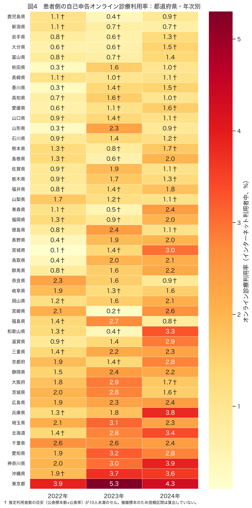
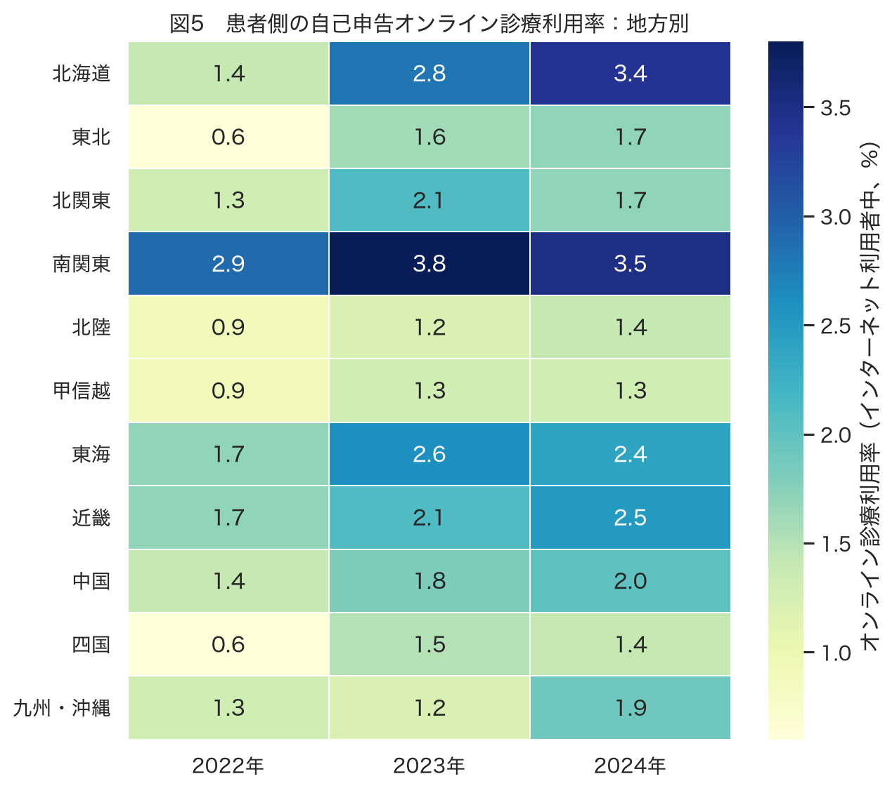
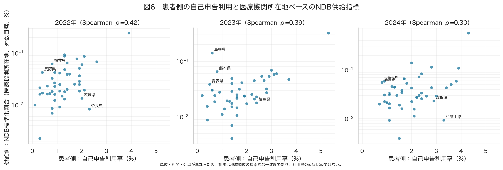
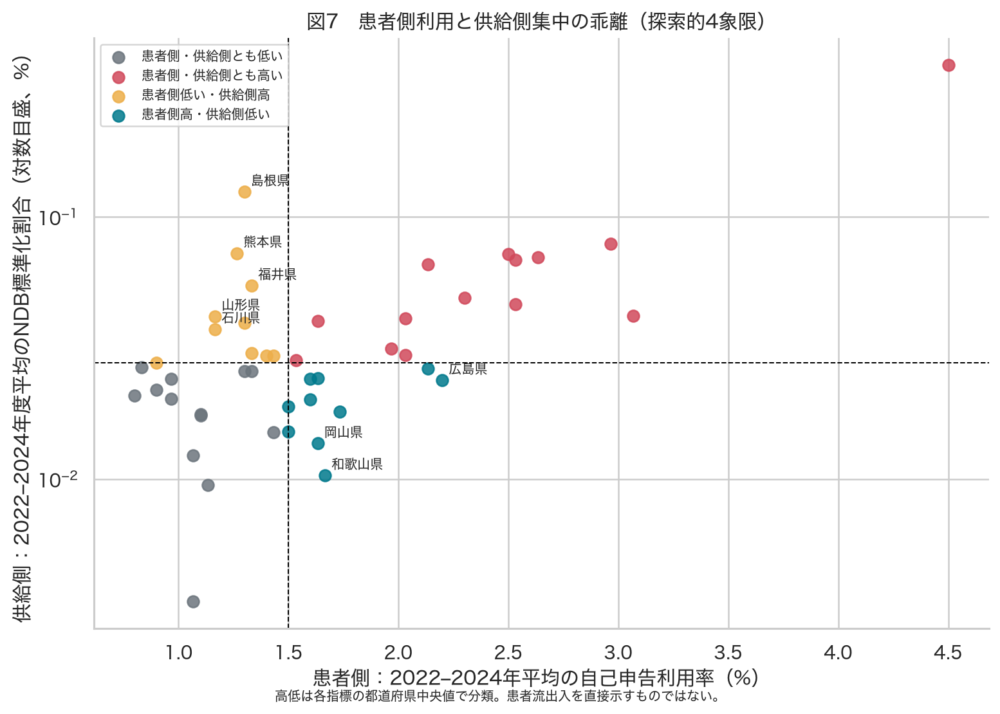
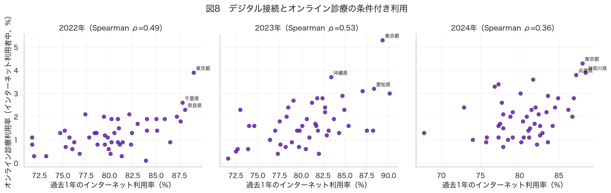

## 結論

通信利用動向調査の「オンライン診療の利用」は、医療機関所在地ベースのNDB指標とは別の地域像を与えた。両者の都道府県順位の年平均Spearman相関は **0.37** で、供給側の集中だけから自己申告利用を推測するのは難しい。公開中医協資料でも、情報通信機器を用いた初・再診料等の **51.1%** が患者と医療機関で異なる都道府県にまたがると報告されており、この解釈と整合する。表15は保険診療と自由診療を区別しないため、NDB保険診療の需要量や需給比を示す指標には使わない。

都道府県別の自己申告率には標本誤差の問題が大きい。公表された集計人数と率からの目安では、都道府県×年セルの **53.2%** が「利用者10人未満」に相当する。このため、単年ランキングを主結果にせず、3年平均・年次の再現性・地方別結果を併記した。

## データと定義

- 自己申告の補助指標：総務省「通信利用動向調査」世帯構成員編・表15（2022–2024年）。質問対象は**過去1年間にインターネットを利用した者**であり、過去1年にオンライン診療を利用した割合（複数回答）。人口全体の利用率ではなく、**保険診療と自由診療を区別しない**。したがってNDB保険診療の需要・需給比には用いず、一般的なデジタル利用の補助指標としてのみ扱う。
- デジタル接続：同じ調査の問1「過去1年間のインターネット利用経験（対象：全員）」。
- 供給側：このリポジトリに既存のNDBオープンデータ集計。都道府県は**医療機関所在地**で、年齢・性別で直接標準化した外来診療に占めるICT診療割合。
- 通信利用動向調査は暦年・過去1年の自己申告、NDBは年度の算定回数であり、対応年同士の比較も探索的である。

### 全国値

| 調査年 | 表15の集計人数 | オンライン診療利用率 | インターネット利用率 |
| --- | --- | --- | --- |
| 2022 | 31844.0 | 1.8% | 83.1% |
| 2023 | 27805.0 | 2.5% | 83.4% |
| 2024 | 30286.0 | 2.5% | 83.1% |

e-Stat表15の全国値は2022年1.8%、2023年2.5%、2024年2.5%だった。これは今回ダウンロードした公式CSVを直接読んだ値である。

## 結果

都道府県順位の年次間Spearman相関の平均は、患者側で **0.34**、供給側NDBで **0.77** だった。患者側の県別順位には偶然変動が大きいため、以下の乖離は仮説生成として扱う。

### 地方別（3年平均）

| 地方 | 利用率3年平均 | 利用率2024年 |
| --- | --- | --- |
| 南関東 | 3.4% | 3.5% |
| 北海道 | 2.5% | 3.4% |
| 東海 | 2.2% | 2.4% |
| 近畿 | 2.1% | 2.5% |
| 中国 | 1.7% | 2.0% |
| 北関東 | 1.7% | 1.7% |
| 九州・沖縄 | 1.5% | 1.9% |
| 東北 | 1.3% | 1.7% |
| 北陸 | 1.2% | 1.4% |
| 甲信越 | 1.2% | 1.3% |
| 四国 | 1.2% | 1.4% |

患者側利用率と地域のインターネット利用率の年平均Spearman相関は **0.46** であり、接続率だけで患者側の条件付き利用を説明できるわけではない。

### 乖離が大きい県（3年平均の順位差）

| 都道府県 | 患者側利用率3年平均 | 供給側NDB割合3年平均 | 供給順位－患者順位 | 患者側年次幅 | 低精度目安年数 | 探索的類型 |
| --- | --- | --- | --- | --- | --- | --- |
| 島根県 | 1.3% | 0.125% | +26.3 | 1.4% | 2 | 患者側低い・供給側高 |
| 熊本県 | 1.3% | 0.073% | +23.2 | 0.9% | 3 | 患者側低い・供給側高 |
| 福井県 | 1.3% | 0.055% | +20.0 | 1.0% | 2 | 患者側低い・供給側高 |
| 岡山県 | 1.6% | 0.014% | -19.5 | 0.9% | 1 | 患者側高・供給側低い |
| 和歌山県 | 1.7% | 0.010% | -19.2 | 2.9% | 2 | 患者側高・供給側低い |
| 山形県 | 1.2% | 0.042% | +18.8 | 2.0% | 2 | 患者側低い・供給側高 |
| 広島県 | 2.2% | 0.024% | -16.5 | 0.5% | 0 | 患者側高・供給側低い |
| 石川県 | 1.2% | 0.037% | +15.7 | 0.5% | 2 | 患者側低い・供給側高 |

順位差が正は「患者側利用率に比べて供給側が高い」、負は「供給側に比べて患者側が高い」ことを示す。単位が違うため、ここでは大小そのものではなく県内での相対順位だけを比べた。

## 解釈と仮説の検証

この比較は保険診療の需給不均衡の判定ではない。自己申告値には自由診療も混在し得るため、ここでは地域像がどの程度異なるかを確かめる補助的な感度分析として扱う。自己申告が高くNDB供給側が低い県では、住民が県外の医療機関を利用している、あるいは自己申告とレセプト算定の対象・期間が異なる、という仮説がある。供給側が高く自己申告が低い県では、専門施設や大規模なオンライン診療提供者が域外患者を診ている可能性がある。

このうち「患者所在地と医療機関所在地の乖離」という機序自体は、無料で公開されている中医協資料で検証できる。同資料はNDBの2024年9–11月診療分について、都道府県が異なる患者・医療機関の組合せが51.1%（72,659/142,174回）と報告し、東京都所在医療機関では県外患者の割合が初診68.1%、再診等65.3%と示す。したがって、NDBの医療機関所在地を患者側分布の代替として扱わない判断には直接の根拠がある。

ただし、この公開資料だけでは今回の各乖離県の患者流出入を直接検証できない。個別県の結論を強めるには、次の検証が必要である。

1. 公開可能な患者住所地NDB集計の都道府県別数値を取得し、同時期の供給側NDBとの流入・流出差を計算する。
2. 通信利用動向調査の都道府県別推計に標準誤差または設計情報が利用できる場合、調査設計に対応した区間推定または縮約推定を行う。
3. 年齢別の患者側利用率が入手できる範囲で、都道府県の年齢構成を調整し、年齢構成による差を切り分ける。

## 限界

- 表15の分母はインターネット利用者であり、全住民の利用率には変換していない。インターネット利用率との単純な積も推定していない。
- 複雑標本・比重調整後の公表率であり、単純無作為抽出の信頼区間は不適切である。ここで示す利用者数目安は不確実性の警告であって推定標準誤差ではない。
- 自己申告の利用経験、NDBの保険診療の算定回数、期間、年齢対象は異なる。相関や4象限を患者移動の直接証拠としては解釈しない。
- 表15は保険診療と自由診療を区別しない。このため、本レポートの自己申告値をNDB保険診療の需要量、未充足需要、供給・需要比の分母には用いない。

## 出典

- 総務省・e-Stat：2022 [表15](https://www.e-stat.go.jp/stat-search/files?layout=dataset&stat_infid=000040057188)、[インターネット利用経験](https://www.e-stat.go.jp/stat-search/files?layout=dataset&stat_infid=000040057181)、2023 [表15](https://www.e-stat.go.jp/stat-search/files?layout=dataset&stat_infid=000040185454)、[インターネット利用経験](https://www.e-stat.go.jp/stat-search/files?layout=dataset&stat_infid=000040185447)、2024 [表15](https://www.e-stat.go.jp/stat-search/files?layout=dataset&stat_infid=000040278952)、[インターネット利用経験](https://www.e-stat.go.jp/stat-search/files?layout=dataset&stat_infid=000040278945)。
- 厚生労働省・中医協 [情報通信機器を用いた診療の患者・医療機関住所地集計](https://www.mhlw.go.jp/content/10808000/001591982.pdf)（NDB 2024年9–11月診療分）。
- 厚生労働省・中医協 [医療機関住所地と患者住所地の地域分布に関する資料](https://www.mhlw.go.jp/content/12404000/001506683.pdf)。
- 供給側の作成手順と定義：このリポジトリの `reports/analysis_report.qmd`、`output/tables/prefecture_standardized.csv`。
