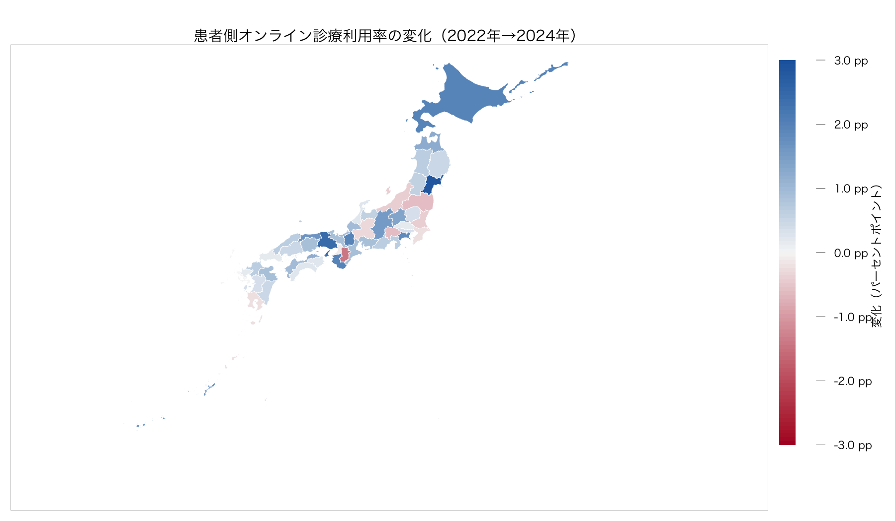

# 患者居住地別のオンライン診療利用：2022–2024年地図

## この図が示すもの・示さないもの

この分析は、総務省「通信利用動向調査」の回答者の**居住都道府県**別・自己申告による「過去1年間のオンライン診療利用率」を可視化したものである。居住地の患者側地域像を補助的に示すが、NDBの患者住所地集計ではない。また、保険診療と自由診療を区別しないため、NDB保険診療の需要量や都道府県別の需給比を測るものではない。

## 結果

| 年 | 47都道府県の単純平均 | 都道府県数 |
| --- | --- | --- |
| 2022 | 1.3% | 47 |
| 2023 | 1.7% | 47 |
| 2024 | 2.0% | 47 |

2022年から2024年に1.5ポイント以上上昇したのは 9 県である。ただし、2022年と2024年の両端で、公表標本数×公表率による利用者数目安が10人以上なのは 1 県のみだった。以下の『増加』は、仮説生成のための記述であり、複雑標本設計を反映した差の検定ではない。

| 居住都道府県 | 2022年 | 2024年 | 変化 | 利用者数目安 2022 | 利用者数目安 2024 | 両端10人以上 |
| --- | --- | --- | --- | --- | --- | --- |
| 宮城県 | 0.1% | 3.0% | +2.9ポイント | 0.7 | 19.9 | いいえ |
| 兵庫県 | 1.3% | 3.8% | +2.5ポイント | 6.2 | 23.5 | いいえ |
| 北海道 | 1.4% | 3.4% | +2.0ポイント | 9.1 | 15.9 | いいえ |
| 滋賀県 | 0.9% | 2.9% | +2.0ポイント | 6.2 | 22.2 | いいえ |
| 和歌山県 | 1.3% | 3.3% | +2.0ポイント | 8.0 | 16.7 | いいえ |
| 神奈川県 | 2.0% | 3.9% | +1.9ポイント | 13.1 | 26.1 | はい |
| 鳥取県 | 0.4% | 2.1% | +1.7ポイント | 2.5 | 12.5 | いいえ |
| 沖縄県 | 1.9% | 3.6% | +1.7ポイント | 7.4 | 12.1 | いいえ |
| 長野県 | 0.4% | 2.0% | +1.6ポイント | 3.1 | 13.7 | いいえ |

2024年の調査では神奈川県が、1.9ポイント増かつ両端の利用者数目安が10人以上という条件を満たす。一方、宮城・兵庫・北海道・滋賀・和歌山・鳥取などの大きな見かけ上の増加は、2022年側の利用者数目安が10人未満であるため、都道府県順位や前年差として強く解釈しない。

## 限界

- 分母は過去1年間にインターネットを利用した者であり、全住民に対する利用率ではない。
- 自己申告データは保険診療と自由診療を区別せず、NDBの保険請求とは対象・期間・単位が異なる。
- 公表率と公表標本数から作る利用者数目安は、複雑標本の標準誤差・信頼区間ではない。小さい値の警告として用いる。
- 公開された患者住所地NDB資料は全国集計であり、この調査の都道府県別結果を保険診療患者の流出入として検証することはできない。

## 出典

- 総務省・e-Stat：2022 [表15](https://www.e-stat.go.jp/stat-search/files?layout=dataset&stat_infid=000040057188)、2023 [表15](https://www.e-stat.go.jp/stat-search/files?layout=dataset&stat_infid=000040185454)、2024 [表15](https://www.e-stat.go.jp/stat-search/files?layout=dataset&stat_infid=000040278952)。
- NDB患者住所地の全国集計・定義：厚生労働省・中医協 [情報通信機器を用いた診療の患者・医療機関住所地集計](https://www.mhlw.go.jp/content/10808000/001591982.pdf)（NDB 2024年9–11月診療分）。
