```{r setup}
knitr::opts_chunk$set(fig.width = 10, fig.height = 6, dpi = 120)
root <- if (file.exists("output/tables/national_trend.csv")) "." else ".."
fig_dir <- file.path(root, "output", "figures")
tab_dir <- file.path(root, "output", "tables")

read_tab <- function(name) {
  read.csv(file.path(tab_dir, name), fileEncoding = "UTF-8")
}

fmt_pct <- function(x, digits = 3) sprintf(paste0("%.", digits, "f%%"), x * 100)
fmt_n <- function(x) format(x, big.mark = ",", scientific = FALSE)
```

## 1. はじめに

本報告書は、厚生労働省 **NDB オープンデータ** を用いた **2022～2024 年度の全国反復横断研究** について、統計解析計画書（SAP ver 1.1）に沿って整理したものです。

### Clinical Question（Primary）

> 2022 年度の診療報酬改定後、日本における情報通信機器を用いた診療の利用割合は 2024 年度までにどのように変化し、その変化は年齢、性別、初診／再診によって異なるか？

### Supplementary（historical context）

2019～2021 年度の旧「オンライン診療料」は、2022 年度以降の ICT 初再診・外来とは **診療報酬上の定義が異なる** ため、主 CQ とは連続比較せず、補足的に記述する。

### 制度上の主要イベント

| 時期 | 内容 |
|------|------|
| 2018 年度 | オンライン診療料の新設 |
| 2020 年 4 月 | COVID-19 に伴う電話・オンライン診療の特例開始 |
| 2022 年度 | 情報通信機器（ICT）を用いた初診・再診・外来診療料の新設 |
| 2024 年 3 月 | COVID-19 特例の終了 |

::: {.callout-important}
2019～2021 年度は **オンライン診療料（加算）**、2022 年度以降は **ICT を用いた初再診・外来** と定義が異なります。**2019～2024 を同一アウトカムとして連続表示しません。** 主 Figure は 2022～2024 の ICT のみとし、旧制度は Supplementary に分離します（SAP 5.1 / 5.1a）。
:::

---

## 2. 方法（概要）

- **デザイン**: 2022～2024 年度の全国反復横断研究（集計データ）
- **データ**: NDB オープンデータ（医科・初再診料・クロス集計）
- **主アウトカム**: 外来診療に占めるオンライン診療の割合
  - **初診**: ICT 初診算定回数 / 全初診算定回数
  - **再診**: ICT 再診・外来算定回数 / 全再診・外来算定回数
- **主解析（2022～2024）**: 集計セルを単位とした **binomial regression**（log link → risk ratio）
- **副次解析**: 都道府県別 **人口あたり ICT 算定回数**（10万人あたり、総務省人口推計を分母）

---

## 3. 結果

### 3.1 主解析期間のトレンド（Figure 1, 2022–2024）

```{r trend-table}
trend <- read_tab("national_trend.csv")
ict_trend <- trend[trend$era == "ict" & trend$visit_type %in% c("initial", "followup"), ]
ict_trend$series <- ifelse(ict_trend$visit_type == "initial", "初診（ICT）", "再診・外来（ICT）")
ict_trend$割合 <- fmt_pct(ict_trend$proportion, 4)
ict_trend$算定回数 <- fmt_n(ict_trend$online_count)
knitr::kable(
  ict_trend[, c("fiscal_year", "series", "算定回数", "割合")],
  col.names = c("年度", "系列", "ICT 算定回数", "割合"),
  caption = "表1. 全国 ICT 利用の経年推移（2022–2024）"
)
```

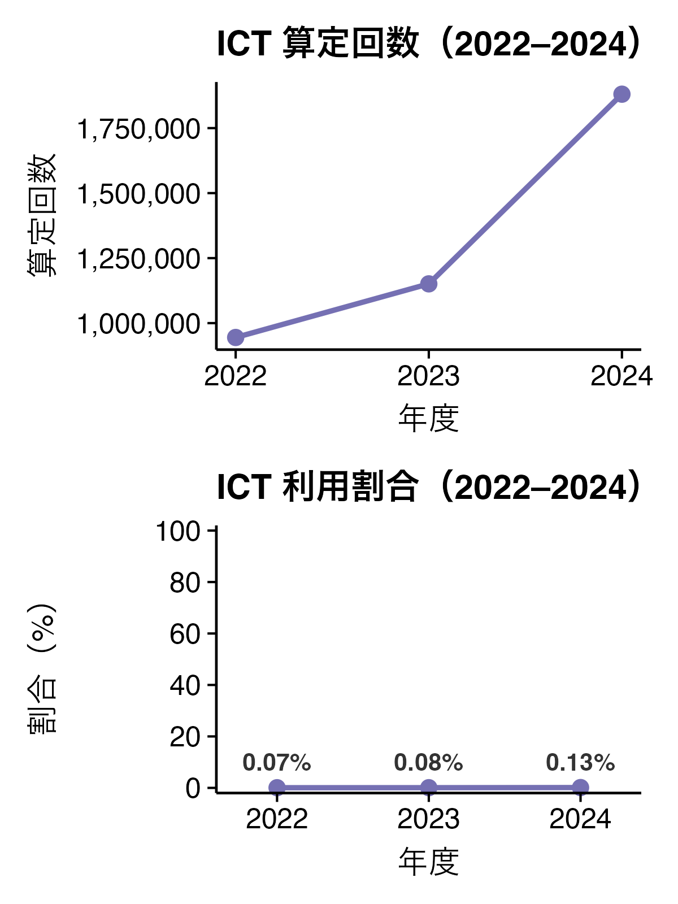

#### 解釈

**2022～2024 年度（ICT 時代）**

- **初診**の ICT 算定回数は **38.8 万 → 46.5 万 → 74.5 万** と増加し、割合は **0.17% → 0.18% → 0.29%**。
- **再診・外来**も **55.7 万 → 68.6 万 → 113.5 万** と増加、割合は **0.05% → 0.06% → 0.09%**。
- **初診の割合は再診・外来を一貫して上回る**（2024 年: 0.29% vs 0.09%）。

### 3.1a 補足：制度変更 timeline と旧オンライン診療料

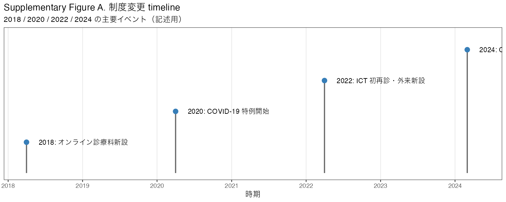

```{r legacy-table}
legacy_trend <- trend[trend$era == "legacy", ]
if (nrow(legacy_trend) > 0) {
  legacy_trend$割合 <- fmt_pct(legacy_trend$proportion, 6)
  legacy_trend$算定回数 <- fmt_n(legacy_trend$online_count)
  knitr::kable(
    legacy_trend[, c("fiscal_year", "算定回数", "割合")],
    col.names = c("年度", "オンライン診療料算定回数", "割合（全外来比）"),
    caption = "表1a. 旧オンライン診療料（2019–2021, Supplementary）"
  )
}
```

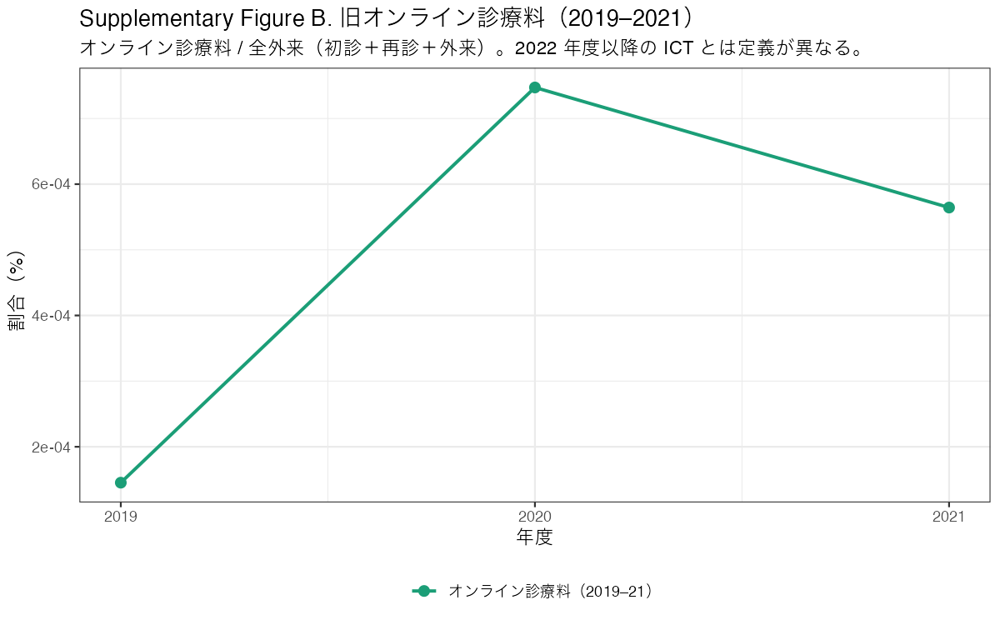

#### 解釈（historical context）

- 2019～2021 年度のオンライン診療料は **加算** として算定され、全外来に対する割合は **極めて小さい**（約 0.0001～0.0007%）。
- COVID-19 流行期（2020）に算定回数は増加したが、2022 年度 ICT 新設後の水準とは **定義が異なる** ため直接比較しない。

---

### 3.2 年齢・初再診別（Figure 2）

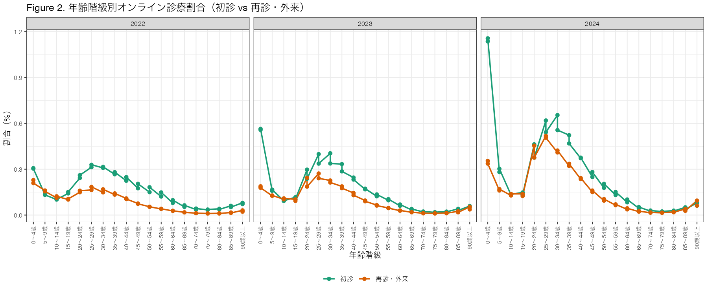

```{r age-2024}
cells <- read_tab("main_analysis_cells.csv")
age2024 <- aggregate(
  proportion ~ age_group + visit_type,
  data = cells[cells$fiscal_year == 2024, ],
  FUN = mean
)
age2024$割合 <- fmt_pct(age2024$proportion, 3)
age2024$種別 <- ifelse(age2024$visit_type == "initial", "初診", "再診・外来")
knitr::kable(
  age2024[order(age2024$age_group), c("age_group", "種別", "割合")],
  col.names = c("年齢階級", "種別", "割合（2024）"),
  caption = "表2. 2024 年度の年齢階級別割合（参考）"
)
```

#### 解釈

- **初診・再診ともに、若年層（とくに 0～4 歳、20～30 代）で割合が相対的に高い** 傾向。2024 年初診では 0～4 歳で約 **1.15%**、25～29 歳で約 **0.58%**。
- **高齢ほど割合は低下**し、70 歳以上では初診 **0.03% 未満** となる年齢階級もある。デジタルアクセスや受診形態の差が反映されている可能性がある。
- **3 年間（2022～2024）を通じて全体的に上昇**しており、制度開始初期から利用が広がりつつある。
- 初診と再診・外来の **パターンの形は類似**（若年高・高齢低）だが、初診の方が水準が高い。

---

### 3.3 年齢別・性別別（Figure 3A / 3B）

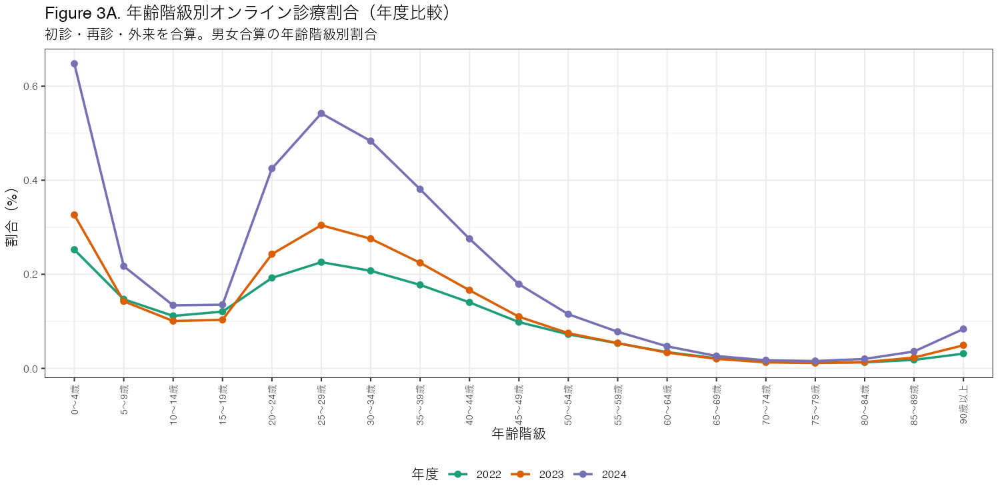

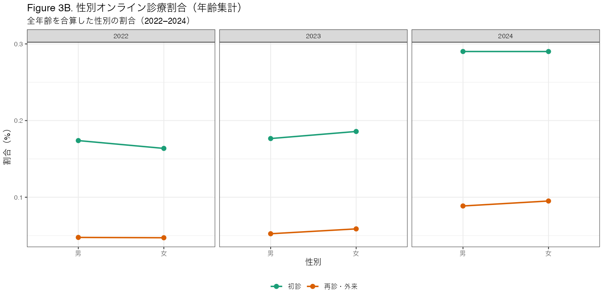

#### 解釈

- **年齢別（Figure 3A）**: 性別を合算すると、若年層で割合が高く高齢ほど低下するパターンが明確。Figure 2 と同型だが、男女を統合した全体傾向を示す。
- **性別別（Figure 3B）**: 全年齢を合算すると、**女性の方が男性より ICT 利用割合がやや高い** 傾向（とくに初診）。差の大きさはモデル結果（表3）で確認。

---

### 3.3a 年齢別の普及（Figure 4）

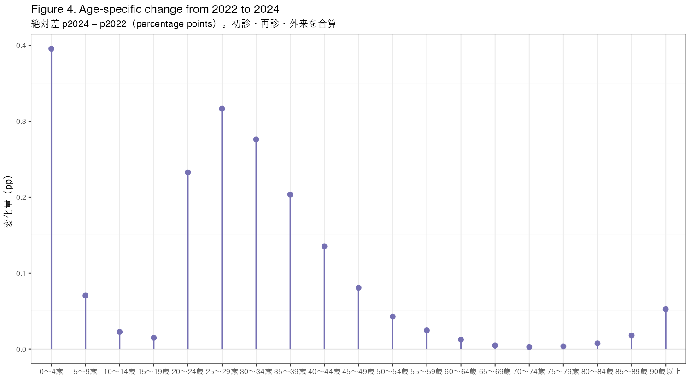

```{r change-table}
change <- read_tab("change_2022_2024_by_age.csv")
change$絶対差 <- sprintf("%.3f pp", change$abs_change_pp)
change$種別 <- ifelse(change$visit_type == "initial", "初診", "再診・外来")
knitr::kable(
  change[order(change$age_group), c("age_group", "種別", "絶対差")],
  col.names = c("年齢階級", "種別", "p2024 − p2022（pp）"),
  caption = "表2a. 年齢階級別の絶対変化（2022→2024）"
)
```

#### 解釈

- **Figure 4** は、年齢階級ごとの **絶対差** $p_{2024} - p_{2022}$（percentage points）をロリポップチャートで示し、「**誰に普及したか**」を初診・再診・外来のパネルで比較する（色は Figure 2 と統一）。
- **若年層（とくに 0～4 歳、20～30 代）で絶対差が大きい** 傾向。高齢層でも増加はあるが、水準・増分ともに小さい。

---

### 3.4 統計モデル（2022～2024、binomial regression）

```{r model-contrasts}
contrasts <- read_tab("model_key_contrasts.csv")
contrasts$差_pp <- sprintf("%.3f pp", contrasts$abs_diff_pp)
contrasts$RR <- ifelse(
  is.na(contrasts$rr), "—",
  sprintf("%.3f (95%%CI %.3f–%.3f)", contrasts$rr, contrasts$rr_lcl, contrasts$rr_ucl)
)
knitr::kable(
  contrasts[, c("contrast", "RR", "差_pp")],
  col.names = c("比較", "Risk ratio", "Absolute difference"),
  caption = "表3. 主要 contrast（基準: 男性・初診・2022 年度・0～4 歳）"
)
```

```{r model-effects}
fx <- read_tab("model_fixed_effects.csv")
key_terms <- fx[fx$term %in% c("sexfemale", "visit_typefollowup", "fiscal_year2023", "fiscal_year2024"), ]
key_terms$RR <- sprintf("%.3f (%.3f–%.3f)", key_terms$rr, key_terms$rr_lcl, key_terms$rr_ucl)
knitr::kable(
  key_terms[, c("term", "RR")],
  col.names = c("項", "Risk ratio (95%CI)"),
  caption = "表4. 主モデルの主要固定効果"
)
```

**モデル**: `cbind(online, non-online) ~ age + sex + visit_type + year + age:visit_type + age:year + visit_type:year`（log link、収束済み）

#### 解釈

| 評価項目 | 結果 | 解釈 |
|----------|------|------|
| 男女差 | RR = **1.019** (1.017–1.021) | 女性は男性より初診 ICT 利用リスクが **約 1.9% 高い**。NDB の大規模性から **統計的有意だが効果量は小さい**。 |
| 初診 vs 再診 | RR = **0.328** (0.325–0.330) | 再診・外来は初診の **約 1/3** のリスク。初診の方が ICT 利用割合が高い。 |
| 2024 vs 2022 | RR = **2.44** (2.42–2.46) | 2 年間で初診 ICT 利用リスクは **約 2.4 倍**。急速な普及を示す。 |
| 年齢効果 | 高齢ほど RR < 1 | 基準（0～4 歳）比で高齢ほど利用リスク低下（交互作用項含む詳細は `model_fixed_effects.csv` 参照）。 |

::: {.callout-note}
SAP の方針どおり、**p 値より effect size（RR・percentage-point difference）を重視**して解釈しています。
:::

---

### 3.5 副次解析：都道府県別人口あたり（Supplementary Figure C）

```{r pref-table}
pref <- read_tab("prefecture_per_capita.csv")
pref <- pref[order(-pref$rate_per_population), ]
pref$率 <- sprintf("%.1f", pref$rate_per_population)
knitr::kable(
  rbind(
    head(pref[, c("prefecture_name", "率")], 5),
    tail(pref[, c("prefecture_name", "率")], 5)
  ),
  col.names = c("都道府県", "10万人あたり算定回数（2024）"),
  caption = "表5. 都道府県別人口あたり ICT 算定回数（上位・下位5県、2024）"
)
```

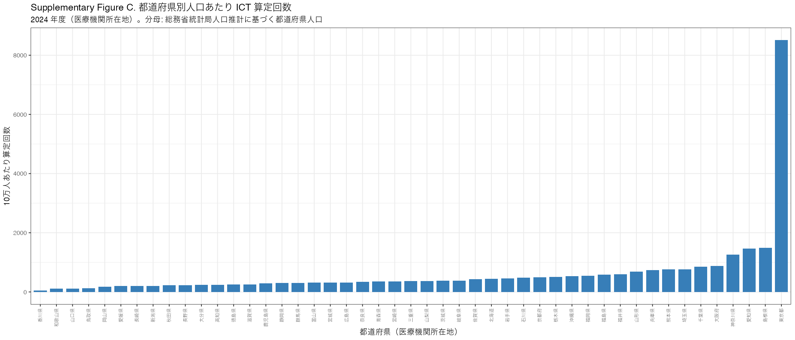

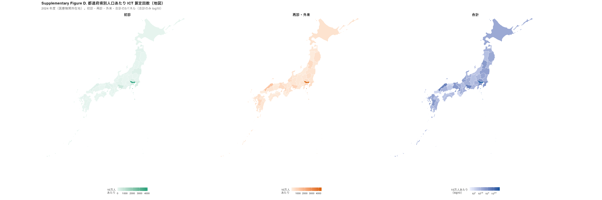

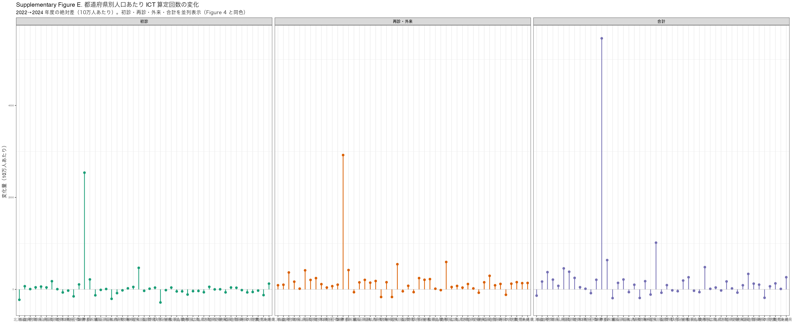

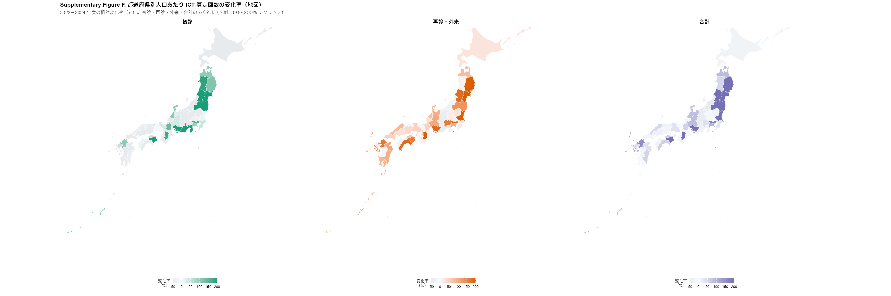

#### 解釈

- **医療機関所在地** に基づく都道府県別の **人口あたり ICT 算定回数**（10万人あたり、2024 年度）。
- 棒グラフ（Figure C）は都道府県を **北から南**（JIS コード順）に並べる。
- 地図（Figure D）は `data/reference/prefectures.geojson`（[dataofjapan/land](https://github.com/dataofjapan/land)）を用いた choropleth。**初診・再診・外来・合計** の3パネル（Figure 4 と同色）。合計パネルのみ log10 スケール。
- **Supplementary Figure E** は、2022→2024 の人口あたり算定回数の **絶対差**（10万人あたり）を、**初診・再診・外来・合計** の3パネルでロリポップ表示（Figure 4 と同色: 初診 `#1b9e77`、再診・外来 `#d95f02`、合計 `#7570b3`）。
- **Supplementary Figure F** は、同じ期間の **相対変化率（%）** を地図 heatmap で **3パネル** 表示（Figure 4 と同色）。凡例は −50～200% でクリップ。
- 分母は **総務省統計局人口推計**（都道府県別総人口）。`data/reference/prefecture_population.csv` を参照。
- **地域の人口規模を考慮した利用率** として解釈できる。ただし医療機関所在地と患者居住地は一致しない場合がある（SAP 6）。

---

## 4. 総合考察

### Clinical Question への回答

1. **2022～2024 年の変化**: ICT 初診・再診・外来の利用割合は **年度とともに増加**。2024 年時点で初診 **0.29%**、再診・外来 **0.09%** 程度。
2. **利用パターン**: **初診 > 再診**、**若年 > 高齢**、**女性 ≥ 男性（差は小）**、**年度とともに増加**。年齢差は初診・再診で同方向。

### Limitation（SAP 8 より）

1. **集計データ**のため、疾患・社会経済状況・デジタルリテラシー等は評価できない。
2. **算定回数ベース**のため、同一患者の複数回受診は区別できない。
3. **2019～21 と 2022～24 で定義が非一貫**なため、長期単純比較には注意が必要。

---

## 5. 付録

### 解析パイプライン

```text
02_load_opendata → 03_build_tables → 04_figures → 05_model_binomial → 06_prefecture_per_capita
```

### 出力ファイル一覧

| 種別 | パス |
|------|------|
| トレンド | `output/tables/national_trend.csv` |
| 主解析セル | `output/tables/main_analysis_cells.csv` |
| モデル | `output/tables/model_fixed_effects.csv` |
| 増加率 | `output/tables/change_2022_2024_by_age.csv` |
| 都道府県（人口あたり） | `output/tables/prefecture_per_capita.csv` |
| 都道府県（2022→2024 変化） | `output/tables/prefecture_per_capita_change_2022_2024.csv` |
| Figure 1–4 | `output/figures/figure*.png` |
| Supp Fig A–D | `output/figures/supplementary_*.png` |

---

*Generated from SAP ver 1.1 / ndb-telemedicine-trends-2026*
