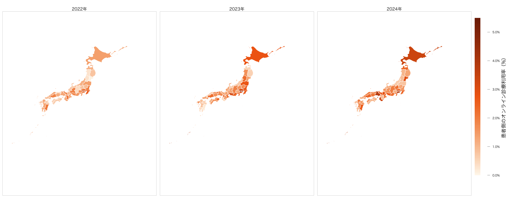
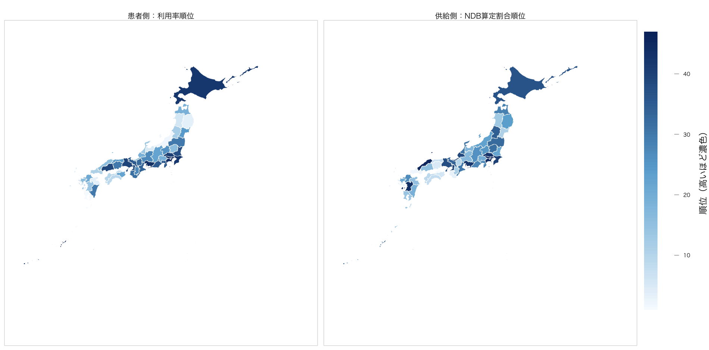
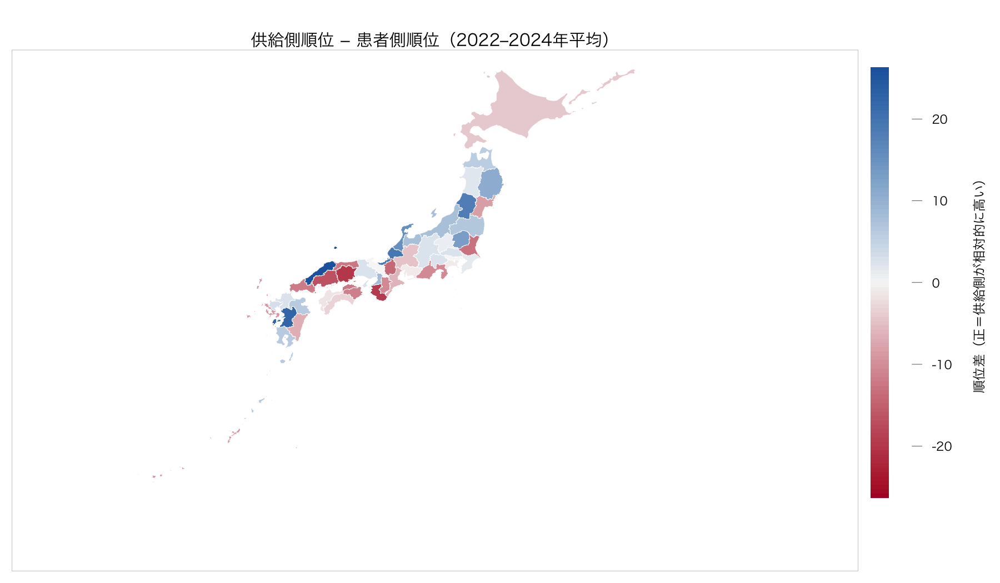
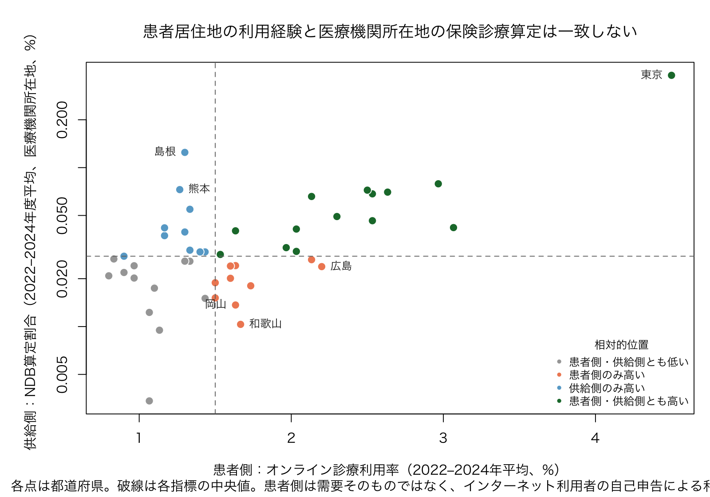

# オンライン診療の利用拡大と地域像：患者居住地と医療機関所在地の違い

## 結論

全国反復横断分析では、情報通信機器を用いた初診・再診・外来の保険算定は2022〜2024年度に増加し、初診で再診・外来より高く、若年層で相対的に高いというパターンがみられた。この全国的な利用拡大を地域で解釈するには、NDBオープンデータの地域値が何を表すかを区別する必要がある。

そこで本分析では、NDBオープンデータで観測できる**医療機関所在地**の保険オンライン診療と、総務省「通信利用動向調査」で観測できる回答者の**居住都道府県**におけるオンライン診療利用経験を並べ、両者を同じ「地域の利用量」と読めるかを検討した。

結論は明確である。2022〜2024年の都道府県順位の年平均Spearman相関は **0.37** にとどまり、患者側で相対的に高い地域と、保険オンライン診療を多く算定する医療機関が所在する地域は、全国的には同じ分布ではなかった。さらに、公開されたNDBの患者住所地×医療機関住所地集計では、2024年9〜11月診療分の情報通信機器を用いた診療の **75.4%** が医療機関と異なる二次医療圏、**51.1%** が異なる都道府県の患者だった。つまり、NDBの医療機関所在地別集計を患者居住地別の需要・アクセス・供給不足の指標として読むことはできない。[中医協総会第625回「外来（その3）」p.19](https://www.mhlw.go.jp/content/10808000/001591982.pdf)

一方で、この比較から都道府県別の患者流出入や、保険診療の供給・需要差を直接推定することもできない。患者側の指標はインターネット利用者を分母とする自己申告で、保険診療と自由診療を区別しない。しかも、都道府県×年セルの53.2%は、公表標本数×公表率からみた利用者数の目安が10人未満だった。したがって本報告の最も強い結論は、**保険請求の供給地と患者側の地域像を分けて報告すべきである**、という点にある。

島根・出雲は、この主分析で見つかった「供給地が患者側の地域像を大きく上回る」外れ値を深掘りした派生分析である。島根の高値は出雲二次医療圏に局在したが、公開データから地域政策による明確な原因は特定できなかった。少数施設、域外患者、診療科構成、既存ICT基盤はいずれも候補だが、どれが主因かを判別する情報はない。出雲は主題そのものではなく、所在地集計だけでは原因を分解できないという limitation を具体化する事例として扱う。

## 1. 問い、データ、比較の単位

| 要素 | 今回用いたもの | この分析での役割 | 解釈上の制約 |
| --- | --- | --- | --- |
| 患者側の地域像 | 総務省「通信利用動向調査」世帯構成員編・表15（2022〜2024年） | 回答者の居住都道府県別・過去1年の自己申告利用率 | インターネット利用者が分母。保険／自由診療、患者数、受診先を区別しない。 |
| 供給側の地域像 | 第9〜11回NDBオープンデータの医療機関所在地集計 | 保険診療の主要3コードを、都道府県・二次医療圏の医療機関所在地で再集計 | 算定回数であり患者数ではない。患者居住地、施設別算定量、診療科は分からない。 |
| 両者の比較 | 都道府県内順位、順位相関、地図、散布図 | 分布がどの程度対応するかの探索 | 分母・単位・観察期間が異なるため、絶対値の比や需給比は作らない。 |
| 直接的な補助根拠 | 中医協の患者住所地×医療機関住所地NDB全国集計 | 地域をまたぐ受診が大きいことの確認 | 全国集計であり、島根や各都道府県の流入出は示さない。 |

NDB側は「情報通信機器を用いた」初診料、再診料、外来診療料の3コードを用いた。関連する全情報通信機器コードに占める捕捉率は2022年度99.21%、2023年度99.58%、2024年度99.73%であり、保険オンライン診療の地域的な算定比較に十分な範囲を覆う。[第9回NDBオープンデータ](https://www.mhlw.go.jp/stf/seisakunitsuite/bunya/0000177221_00014.html)、[第10回](https://www.mhlw.go.jp/stf/seisakunitsuite/bunya/0000177221_00016.html)、[第11回](https://www.mhlw.go.jp/stf/seisakunitsuite/bunya/0000177221_00017.html)

この定義の違いは本質的である。以下では便宜上「患者側」と「供給側」と呼ぶが、患者側は保険診療需要の推定値ではなく、居住地別の利用経験の proxy である。また供給側は施設数や供給能力ではなく、医療機関所在地で観測された保険算定量の proxy である。

## 2. 地域分析で実施したこと

| 分析のまとまり | 実施内容 | 主な成果物 | 本報告での位置づけ |
| --- | --- | --- | --- |
| 患者側データの取得・整形 | 2022〜2024年の表15とインターネット利用経験を公式CSVから抽出し、居住都道府県・地方別データに整形 | `scripts/07_fetch_communications_survey.py`、`patient_survey_*.csv` | 主分析の患者側指標 |
| 患者側と供給側の比較 | 順位相関、年次安定性、順位差、地方別推移を作成 | `scripts/08_analyze_patient_geography.py`、`patient_supply_*.csv` | 主分析 |
| 保険診療の供給地分析 | NDBの都道府県・二次医療圏別算定、集中度、人口・診療所との探索的関連を確認 | `scripts/10_analyze_ndb_supply_geography.py`、図9〜11 | 主分析の供給側の文脈 |
| 外部資料との照合 | 患者住所地クロス集計、人口・施設統計、制度・政策資料を収集し、仮説を時系列・定義で点検 | `scripts/09_fetch_context_sources.py` | 解釈の裏づけと過剰解釈の除外 |
| 島根・出雲の追加検証 | 隣県・二次医療圏・算定構成を分解し、外来機能報告で施設集中仮説を点検 | `scripts/11_analyze_outpatient_function_report.py` | 島根外れ値の派生分析・limitation |
| 地図・散布図の最終描画 | 都道府県GeoJSONから、ラベルを置かないR標準描画の地図と比較散布図を作成 | `scripts/13_render_patient_geography_maps.R`、図1〜4 | 地域差を比較可能な形で示す可視化 |
| 再現環境の整備 | 第11回NDBオープンデータを取得対象に加え、Python仮想環境・依存関係・実行手順を整備 | `config/ndb_rounds.yml`、`scripts/01_fetch_ndb_opendata.py`、`scripts/bootstrap_python.sh`、`README.md` | 分析を再実行するための基盤 |

途中過程の [`patient_geography_report.html`](../output/reports/patient_geography_report.html) と [`ndb_supply_geography_report.html`](../output/reports/ndb_supply_geography_report.html) も確認し、本報告では前者から患者側調査の不安定さ・地域差・順位差を、後者からNDBコードの捕捉率・二次医療圏の集中・島根の検証を統合した。

## 3. 主結果：患者居住地の利用経験と保険診療の供給地はどこまで対応するか

### 3.1 患者側の自己申告は全国では上昇したが、県別順位は安定しない

通信利用動向調査で「過去1年間にオンライン診療を利用した」と自己申告したインターネット利用者の全国割合は、2022年1.8%、2023年2.5%、2024年2.5%だった。これは保険診療の利用率ではなく、居住地を持つ回答者の利用経験である。[2022年表15](https://www.e-stat.go.jp/stat-search/files?layout=dataset&stat_infid=000040057188)、[2023年表15](https://www.e-stat.go.jp/stat-search/files?layout=dataset&stat_infid=000040185454)、[2024年表15](https://www.e-stat.go.jp/stat-search/files?layout=dataset&stat_infid=000040278952)

*図1　回答者の居住都道府県別にみた自己申告利用率。地図上に都道府県名などのラベルは置いていない。色はインターネット利用者に占める割合であり、保険／自由診療を分けない。Rで `supplementary_prefecture_per_capita_map_2024.png` と同じ都道府県GeoJSONから再描画した。出典：総務省「通信利用動向調査」表15。*

地図の上位・下位を具体的に読むため、2024年の値を併記する。上位の東京都（4.3%）、神奈川（3.9%）、兵庫（3.8%）は利用者数目安も20人超である。一方、下位県の値は利用者数目安が4〜8人程度にとどまるものが多く、低率県どうしの順位は特に慎重に扱う必要がある。

| 2024年患者側自己申告率の上位 | 利用率 | 利用者数目安 | 2024年患者側自己申告率の下位 | 利用率 | 利用者数目安 |
| --- | ---: | ---: | --- | ---: | ---: |
| 東京都 | 4.3% | 32.8 | 新潟県 | 0.7% | 5.0 |
| 神奈川県 | 3.9% | 26.1 | 福島県 | 0.8% | 4.6 |
| 兵庫県 | 3.8% | 23.5 | 山形県 | 0.9% | 8.0 |
| 沖縄県 | 3.6% | 12.1 | 奈良県 | 0.9% | 6.1 |
| 北海道 | 3.4% | 15.9 | 鹿児島県 | 0.9% | 3.6 |

患者居住地と医療機関所在地を見比べるため、既存の全国分析で作成した `supplementary_prefecture_per_capita_map_2024.png`（既存Supplementary Figure D）も参考図Aとして掲載する。この図は2024年度の主要オンライン算定を医療機関所在地別・人口10万人当たりで示す。図1の患者居住地別自己申告率とは分母・対象が異なるため、色の濃さや値を直接比べるものではないが、地域像の違いを確認する比較の基準になる。

*参考図A　既存のNDBオープンデータ図。医療機関所在地別の主要オンライン算定回数を人口10万人当たりで示す。患者側地図と見比べるために必要な既存図として掲載した。*

| 2024年度NDB医療機関所在地別・人口10万人当たりの上位 | 人口10万人当たり | 主要算定回数 | 下位 | 人口10万人当たり | 主要算定回数 |
| --- | ---: | ---: | --- | ---: | ---: |
| 東京都 | 8,507.3 | 1,172,869 | 香川県 | 49.8 | 464 |
| 島根県 | 1,484.5 | 9,778 | 和歌山県 | 113.8 | 1,030 |
| 愛知県 | 1,459.7 | 108,049 | 山口県 | 113.8 | 1,499 |
| 神奈川県 | 1,257.4 | 113,990 | 鳥取県 | 121.2 | 658 |
| 大阪府 | 874.5 | 75,848 | 岡山県 | 178.7 | 3,312 |

*注：この表と参考図Aは人口10万人当たりの保険算定であり、図3以降の「標準外来基本料に対する算定割合」とは別の供給側指標である。いずれも医療機関所在地を表す。*

患者側順位の年次間Spearman相関は2022–2023年0.34、2022–2024年0.40、2023–2024年0.27（平均0.34）だった。対してNDB供給側順位は0.72、0.67、0.92（平均0.77）である。患者側では各年の利用者数目安が10人未満のセルが53.2%を占めるため、県別の濃淡や順位を有意差として読むことはできない。地図は「居住地分布の候補」を示すものであり、単年の高低を県固有の差と決めつけない。

2022〜2024年の県別変化も確認したが、見かけ上1.5ポイント以上増えた9県のうち、両端年で利用者数目安が10人以上だったのは神奈川のみだった。県別変化の地図と一覧は、患者側分布が固定的ではないことを示す補助資料として付録に示す。

### 3.2 患者側（需要 proxy）と供給側の多寡は、一部で一致しても全体ではずれる

患者側の自己申告率とNDB供給地の標準化割合とのSpearman相関は、2022年0.42、2023年0.39、2024年0.30（平均0.37）だった。両者は全く無関係ではないが、医療機関所在地から患者居住地の利用分布を代替できるほどには一致しない。

*図2　左は患者側の自己申告利用率順位、右は医療機関所在地別NDB算定割合順位。2022〜2024年平均の都道府県内順位で描き、異なる分母の絶対値を比べていない。濃色ほど相対的に高い。*

*図3　供給側順位−患者側順位。青ほど、医療機関所在地としての保険算定順位が患者側自己申告順位より相対的に高い。赤はその逆である。順位差は需給差ではない。*

*図4　患者側（需要 proxy）と供給側の多寡を一つの点で示した散布図。各点は都道府県、破線は各指標の中央値、縦軸は対数目盛である。東京都と、順位差が大きい島根・熊本・岡山・和歌山・広島だけをラベルで示した。患者側は保険診療需要そのものではないため、4象限を供給不足／過剰の判定には使わない。*

3年平均の順位差が大きい県を例示すると、島根（供給側−患者側=+26.3位）、熊本（+23.2位）、福井（+20.0位）は、自己申告利用率に比べて医療機関所在地の保険算定順位が高かった。反対に、岡山（−19.5位）、和歌山（−19.2位）、広島（−16.5位）は、患者側順位が供給側順位より高かった。東京都は両側で47位、神奈川は患者側45位・供給側45位であり、すべての地域で乖離するわけではない。

| 供給側が相対的に高い上位 | 患者側利用率（3年平均） | 供給側NDB算定割合（3年平均） | 順位差 | 患者側が相対的に高い上位 | 患者側利用率（3年平均） | 供給側NDB算定割合（3年平均） | 順位差 |
| --- | ---: | ---: | ---: | --- | ---: | ---: | ---: |
| 島根県 | 1.30% | 0.125% | +26.3位 | 岡山県 | 1.63% | 0.014% | −19.5位 |
| 熊本県 | 1.27% | 0.073% | +23.2位 | 和歌山県 | 1.67% | 0.010% | −19.2位 |
| 福井県 | 1.33% | 0.055% | +20.0位 | 広島県 | 2.20% | 0.024% | −16.5位 |

*注：供給側NDB算定割合は、主要オンライン3コード÷通常の初診・再診・外来診療料3コードである。患者側と分母が違うため、表中の2列の%を直接差し引いたものではなく、都道府県内順位の差を示す。*

このずれには、少なくとも次の三つの説明が同時にあり得る。

1. 患者が居住都道府県外の医療機関を利用する広域提供・域外受診。
2. 通信利用動向調査には自由診療も含まれるため、NDB保険算定と異なる診療が地域差に混在すること。
3. 自己申告の標本変動、暦年の過去1年利用と年度のレセプト算定という期間差、患者数と算定回数という単位差。

第1の機序の存在は、上記のNDB患者住所地×医療機関住所地集計で直接確認できる。これは「どの県で需給がずれたか」を示す資料ではないが、所在地集計を患者居住地の分布として読む前提を崩すには十分に重要である。特に、供給側が高い島根や患者側が相対的に高い広島・岡山について、県境をまたぐ診療が原因だと断定する根拠にはならない点を区別する必要がある。

### 3.3 保険オンライン診療の算定地は、二次医療圏レベルでも拠点に集中する

主要3コードの全国算定回数は2022年度93.8万回、2023年度114.7万回、2024年度187.6万回だった。医療機関所在地で集計した二次医療圏の上位5圏が占める観測算定回数の割合は、それぞれ41.4%、53.9%、65.1%へ上昇した。

*図5　主要3コードの算定回数を医療機関所在地の二次医療圏で並べたもの。上位5圏のシェアは公開表で観測できた値に基づく。秘匿記号をゼロと置いていないため、患者の分布や厳密な全圏シェアを示す図ではない。出典：第9〜11回NDBオープンデータ。*

この集中から「地方の患者が利用できない」とは言えない。二次医療圏は提供医療機関の所在地であり、患者が圏外に住む診療が多いことは全国クロス集計で示されている。ここから支持されるのは、**保険オンライン診療を多く請求する拠点が空間的に集中している**という結論までである。

## 4. 派生分析：島根・出雲の外れ値をどう読むか

島根は、図3で供給側が患者側を大きく上回る県の中でも最大の順位差だったため、供給地側を追加で分解した。2023年度の標準基本料1万回当たり主要オンライン算定は島根12.90で、鳥取2.03、広島2.05、山口0.71を大きく上回った。年齢構成が近い鳥取・山口、同じ中国地方の広島と比べても差が大きく、全国共通の制度変更や「山陰は高齢化している」といった一般論だけでは説明できない。

島根の高値は県内に均一ではない。出雲二次医療圏は2023年度に9,002回、島根県内SMA観測値の92.6%を占め、出雲の標準化率は島根県内の他圏域の30.1倍だった。人口、高齢化、診療所密度、年度で予測する島根除外の探索的モデルでも、島根の観測率は2023年度に予測の10.1倍だった。これは高齢化や診療所密度だけでは説明できない大きさを示す診断であり、政策・診療科・特定施設の効果を推定するものではない。

*図6　島根の高値を隣県、県内二次医療圏、初再診構成、人口・診療所密度による探索的予測で分解した図。出雲の特徴は再診構成比が特別に高いことではなく、算定総量と標準化率が高いことである。右下は因果効果ではなく、測定した県特性だけでは説明できない残差を示す。*

出雲の再診等割合は2023年度83.2%で、比較可能な84医療圏中36位だった。したがって「再診割合が異常に高いから」という説明も支持されない。外来機能報告では、2024年の出雲の報告対象施設内オンライン外来患者延べ数246のうち最大1施設が233（94.7%）だった。しかし、同報告の2023年観測値76はNDBの9,002回の0.84%にすぎず、無床診療所の報告も任意である。この部分的な集中を、NDB全体で1〜2施設が大半を担った証拠にはできない。[令和6年度外来機能報告公表データ](https://www.mhlw.go.jp/stf/seisakunitsuite/bunya/open_data_00019.html)

### 政策・地域基盤の仮説を時系列で点検した結果

| 候補 | 確認できた事実 | 2023年度の突出を説明する証拠としての評価 |
| --- | --- | --- |
| 長期のICT医療連携基盤（まめネット等） | 1999年の統合情報システム、2000年の隠岐での遠隔画像診断、2013年のまめネット強化など、島根には長期の医療情報連携の蓄積がある。 | 継続診療をデジタル化しやすい背景仮説にはなるが、保険オンライン再診の算定量を直接示さない。 |
| ルピナスネット出雲 | 出雲圏域の医療・在宅連携のICT取組として2024年に運用開始した。 | 2023年度に既に現れた急増の開始原因には置けない。 |
| 出雲市の移動診療車による遠隔医療実証 | 協定は2025年7月、実患者の保険診療は2026年1〜2月である。 | 観察期間より後であり、今回の外れ値の原因から除外できる。 |
| 2022年度診療報酬改定・指針改訂 | 全国共通にオンライン診療の評価体系が整備された。 | 全国的な増加の背景にはなり得るが、島根・出雲だけの突出を説明しない。 |

この時系列照合により、近年の地域事業を2023年度の突出の開始原因とみなす説明は除外できた。一方で、これだけで「地域政策は関係しなかった」とは言えない。長期のICT連携基盤は背景仮説として残り、未観測の提供体制・診療科構成・域外患者の流入も競合する説明である。公開NDBには施設別算定、患者居住地、診療科がなく、政策資料には対照地域や施策前後の比較がないため、これらの候補の寄与を分けられない。したがって、**島根で明確な地域政策が出雲の極端値を生んだという因果的な原因は確認できなかった**、という結論にとどめる。

この派生分析が主結果に加えるものは、所在地集計の外れ値が出雲に局在していること、そして公開NDBだけでは提供者・患者流入・診療科を分解できないことの二点である。島根の患者居住地別の保険算定を示したものではない。

## 5. Discussion：この比較から支持されること、支持されないこと

### 支持される解釈

- NDB地域値は、医療機関所在地での保険オンライン診療算定の地理的分布である。患者居住地の分布と一致しないことは、患者側自己申告との比較と、全国NDBの住所地クロス集計の両方から支持される。
- 保険オンライン診療を多く請求する拠点は、都道府県内でも二次医療圏に集中している。所在地集計の高値には域外患者が含まれ得る。
- 患者側の自己申告で相対的に高い地域とNDB供給側で相対的に高い地域が異なるため、患者居住地の地域像を議論するには、所在地別NDBとは別の患者側データを置く必要がある。
- 島根・出雲のような外れ値は、所在地集計をその地域住民の需要・アクセスとみなす危険を具体的に示す。

### 支持されない解釈

- 自己申告率が高くNDB供給地率が低い県を、保険診療の「供給不足県」と断定すること。
- 供給地率が高い県を、その県の住民の利用率・需要が高い県とみなすこと。
- 通信利用動向調査の自己申告率を、NDB保険診療の患者数、未充足需要、または供給・需要比の分母に使うこと。
- 島根・出雲の高値を、特定施設、県の政策、高齢化、または再診への偏りの一つに帰属すること。

## 6. Limitation と次に必要な検証

| 残る限界 | なぜ結論を制約するか | 次に必要なデータ・設計 |
| --- | --- | --- |
| 患者側は保険／自由診療を区別しない自己申告 | NDB保険診療の需要量には変換できない | 患者住所地別の保険NDB集計を用いる |
| 患者側の都道府県セルが小さい | 県別順位・変化に大きな標本変動があり得る | 調査設計情報による区間推定、または地方単位への集約 |
| NDBは医療機関所在地・算定回数 | 患者流入出、患者数、施設別寄与を識別できない | 同年度・同コードの患者住所地×医療機関所在地NDBクロス表 |
| 二次医療圏の秘匿セル | 圏別の合計・シェアは観測値または下限になる | 秘匿処理を考慮した集計、または適切な特別抽出 |
| 出雲の施設別・診療科別情報がない | 少数施設、域外患者、特定疾患の継続診療を区別できない | NDB特別抽出または提供者・保険者との施設別集計 |
| 政策資料は実施経緯を示すのみ | 施策の反実仮想がなく、県間差の因果効果を推定できない | 対照地域・開始時点・対象施設を置いた事前規定の評価設計 |

最優先は、同一年度・同一保険コードについて患者住所地×医療機関所在地を都道府県・二次医療圏別に得ることである。これにより、今回の不一致を実際の患者流入出と、保険外も含む自己申告との違いに分けられる。出雲については、施設別・診療科別の情報を加えて初めて、少数提供者への集中、県外患者の流入、特定疾患の継続再診という競合仮説を検証できる。

## 7. 再現手順と図表

| 目的 | 実行スクリプト | 主な出力 |
| --- | --- | --- |
| 通信利用動向調査の取得 | `scripts/07_fetch_communications_survey.py` | `data/raw/communications_survey/` |
| 患者側・供給側の数値集計 | `scripts/08_analyze_patient_geography.py` | `patient_supply_comparison.csv`、`patient_geography_report.html` |
| NDB供給地・島根の再集計 | `scripts/10_analyze_ndb_supply_geography.py` | `ndb_provider_*.csv`、`figure10_ndb_sma_concentration.png`、`figure11_shimane_case_study.png` |
| 患者側年次変化の集計 | `scripts/12_analyze_patient_location_trends.py` | `patient_location_change_2022_2024.csv`、`patient_location_trends_report.html` |
| 患者地理図と比較散布図の最終R描画 | `scripts/13_render_patient_geography_maps.R` | `figure4_patient_prefecture_map.png`、`figure19_patient_location_change_map.png`、`figure20_patient_provider_rank_maps.png`、`figure21_patient_provider_scatter.png`、`figure22_patient_provider_rank_gap_map.png` |
| 出雲の外来機能報告による補助検証 | `scripts/11_analyze_outpatient_function_report.py` | `izumo_facility_concentration_report.html`、図15〜17 |

数値集計を行った後、最終図は `scripts/13_render_patient_geography_maps.R` を最後に実行して作成する。`scripts/08_analyze_patient_geography.py` と `scripts/12_analyze_patient_location_trends.py` にも中間図の描画処理があるため、最後にR描画を実行することで、本文で参照する `figure4` と `figure19`〜`figure22` の表示形式を統一できる。地図は `data/reference/prefectures.geojson` を入力にR標準描画で作成し、追加Rパッケージを必要としない。都道府県名・順位・個別値のラベルを地図上に表示せず、既存の `supplementary_prefecture_per_capita_map_2024.png` と同じ地理境界・塗り分け形式にそろえた。

## 8. 外部ソース

1. 厚生労働省：第9〜11回NDBオープンデータ。保険診療の医療機関所在地別・全国・二次医療圏別の算定集計。[2022年度](https://www.mhlw.go.jp/stf/seisakunitsuite/bunya/0000177221_00014.html)、[2023年度](https://www.mhlw.go.jp/stf/seisakunitsuite/bunya/0000177221_00016.html)、[2024年度](https://www.mhlw.go.jp/stf/seisakunitsuite/bunya/0000177221_00017.html)
2. 厚生労働省・中医協総会第625回「外来（その3）」p.19。NDB 2024年9〜11月診療分の患者・医療機関住所地集計。[PDF](https://www.mhlw.go.jp/content/10808000/001591982.pdf)
3. 総務省・e-Stat：通信利用動向調査・世帯構成員編表15（オンライン診療の利用）とインターネット利用経験。患者側の自己申告分布に使用。[2022年表15](https://www.e-stat.go.jp/stat-search/files?layout=dataset&stat_infid=000040057188)、[2022年利用経験](https://www.e-stat.go.jp/stat-search/files?layout=dataset&stat_infid=000040057181)、[2023年表15](https://www.e-stat.go.jp/stat-search/files?layout=dataset&stat_infid=000040185454)、[2023年利用経験](https://www.e-stat.go.jp/stat-search/files?layout=dataset&stat_infid=000040185447)、[2024年表15](https://www.e-stat.go.jp/stat-search/files?layout=dataset&stat_infid=000040278952)、[2024年利用経験](https://www.e-stat.go.jp/stat-search/files?layout=dataset&stat_infid=000040278945)
4. 厚生労働省：令和6年度外来機能報告公表データ。出雲の報告対象施設内の集中度を補助的に確認するために使用。[公表ページ](https://www.mhlw.go.jp/stf/seisakunitsuite/bunya/open_data_00019.html)
5. 総務省統計局：人口推計（2021年10月1日現在）と、厚生労働省・e-Statの2023年医療施設調査表105。島根の探索的残差診断の共変量に使用。[人口推計](https://www.stat.go.jp/data/jinsui/2021np/index.html)、[表105](https://www.e-stat.go.jp/dbview?sid=0004024904)
6. 島根県・出雲市：ICT医療連携の沿革、出雲圏域の在宅連携・ICTの取組、遠隔医療実証の結果。出雲の政策・連携基盤の時系列照合に使用。[島根県ICT連携の沿革](https://www1.pref.shimane.lg.jp/medical/kenko/iryo/shimaneno_iryo/mame-net.data/gyousei.pdf)、[出雲圏域資料](https://www.pref.shimane.lg.jp/medical/kenko/iryo/shimaneno_iryo/iryoushingikai.data/shiryou1-4_R703.pdf)、[出雲市実証結果](https://www.city.izumo.shimane.jp/www/contents/1774239528730/simple/shiryou10.pdf)

## 9. 付録：本文の主要結論を補助する検討

| 確認した事項 | 分かったこと | 本文での扱い | 保存先 |
| --- | --- | --- | --- |
| 患者側の県別年次変化 | 見かけ上1.5ポイント以上増えた9県のうち、両端年で利用者数目安が10人以上だったのは神奈川のみだった。 | 患者側順位の不安定さを示す補助資料として扱い、個別県の利用増加を結論しない。 | `figure19_patient_location_change_map.png`、`patient_location_change_2022_2024.csv` |
| 地方別の患者側推移とインターネット利用率 | 南関東などで自己申告率が高い傾向はあるが、インターネット利用率との年平均順位相関は0.46にとどまった。 | 接続率だけで利用を説明する結果ではなく、主問いである患者・供給側の不一致に対する補助情報である。 | `figure5_patient_region_trend.png`、`figure8_patient_internet_access.png` |
| 4象限・個別県の順位表 | 岡山、和歌山、広島などは患者側相対高・供給側相対低、島根、熊本、福井などは逆の候補だった。 | 自由診療混在・自己申告の不確実性・患者流出入が区別できず、県別の需給判定には使えない。 | `figure7_patient_supply_quadrant.png`、`patient_supply_pooled_summary.csv` |
| 高齢化・診療所密度とNDB供給地 | 高齢化割合と供給地率には負の順位相関がみられたが、交絡を除く因果推定ではない。 | 患者居住地ではない所在地集計を、個人の高齢者利用や地域政策の効果に結びつけられない。 | `figure9_ndb_prefecture_hypotheses.png`、`ndb_provider_associations.csv` |
| 2019〜2021年度の旧オンライン診療料 | 2022年度以降と制度・コード定義が異なる。 | 同一アウトカムの連続時系列にすると制度変更を利用増加と取り違える。 | `supplementary_legacy_trend.png`、既存SAP |

外来機能報告による出雲の施設集中と、ICT連携・自治体施策の時系列照合は、第4節で島根・出雲の原因を特定できない根拠として扱った。その他の補助検討は、保険診療の患者需要や地域の供給不足へ所在地集計を過剰に拡張しないために保存している。
